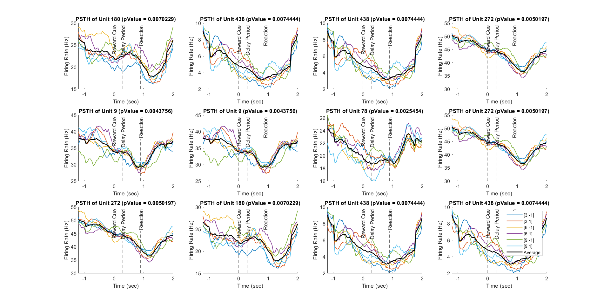

###### [Arya Koureshi](https://aryakoureshi.github.io)
---

#### Aim
Studying the population response structure

---

#### Task description
Uncertainty is a ubiquitous component of our environment, such that humans and animals are regularly 
confronted with conditions that vary in degrees of uncertainty. It is therefore a fundamental requirement 
of our brain systems to accurately process uncertain information so that we may function appropriately, 
both in our mundane day-to-day activities and in more profound moments. Many brain regions including 
the frontal cortex, basal ganglia, amygdala, parietal cortex, cingulate cortex, and insular cortex have been 
identified as key areas in processing information about uncertain rewards.

In this assignment we are going to analyze the activity of a population of single units recorded with multielectrode array in Parietal cortex. The task (Figure 1) is designed to study the encoding of reward expected 
value in area 7a (Figure 2). This area encodes the spatial location of cue [2].

Here in this assignment the question is that is the units in area 7a encode the expected value of the reward 
or not? The other question is that whether population structure conveys more information than single 
units?


---

#### Data Description
When you load the data, a file named ‘Unit’ is added to the workspace. The file contains activities of 481 
single units recorded from an array. In the subfield, ‘Trls’ there is spike times for 192 trials in each single 
unit which is aligned to ‘Cue Onset’. Length of each trial is 3.2 second (1.2 sec before cue onset to 2 sec 
after cue onset). In the subfield ‘Cnd’, there are the trials in each group of the task conditions. The subfield 
‘Value’ in ‘Cnd’ shows the expected value and the cue location in the task.

---

#### Steps of the assignment
**Step 1**: Calculate the PSTH for the units and plot the average PSTH for each condition of the task.

* Q1: Are the PSTH of different units act in the same way?

* Q2: Could you infer the encoding of task parameters from the average PSTH?

```
clc;clear;close all;

%% Loading data and initializing
load 'UnitsData.mat';
NumBins = 64; % number of bins
WidthWindow = 9; % width of the window
cntrs = linspace(-1.2, 2, NumBins);
NeuronIdx = floor(rand(1) * numel(Unit));

%% Step 1
% Q1: PSTH of a random unit
figure
plot_PSTH(Unit, NeuronIdx, WidthWindow, NumBins, cntrs)
print("Step1_Unit_" + num2str(NeuronIdx), '-dpng', '-r0')

% Q2: Average PSTH of all units
figure
hold on
CntAllMean = [];
for CueValue = 3:3:9
    for pos = [-1, 1]
        CntAll = [];
        value = [CueValue, pos];
        for NeuronIdx = 1:numel(Unit)
            data = GetCnd(Unit, NeuronIdx, value);
            [cnts,~] = PSTH(data, WidthWindow, NumBins, cntrs);
            CntAll = [CntAll; cnts];
        end
        CntAll = mean(CntAll,1);
        CntAllMean = [CntAllMean; CntAll];
        plot(cntrs, CntAll, 'LineWidth', 1)
    end
end
CntAllMean = mean(CntAllMean, 1);

plot(cntrs, CntAllMean, 'k', 'LineWidth', 1.5)
xline(0, '--', 'Reward Cue', LabelHorizontalAlignment = 'center');
xline(0.3, '--', 'Delay Period', LabelHorizontalAlignment = 'center');
xline(0.9, '--', 'Reaction', LabelHorizontalAlignment = 'center');
title("Averarge PSTH of All Neurons")
xlabel("Time (sec)")
ylabel('Firing Rate (Hz)')
xlim([-1.2, 2])
legend('[3 -1]', '[3 1]', '[6 -1]', '[6 1]', '[9 -1]', '[9 1]', 'Average')
set(gcf,'PaperPositionMode','auto')
print("Step1_Average_of_All_Units", '-dpng', '-r0')

%% Functions
function [cnts, cntrs] = PSTH(data, WidthWindow, NumBins, cntrs)
    data_all = zeros(numel(data), NumBins);
    for i=1:numel(data)
        [cnts, cntrs] = hist(cell2mat(data(i)), NumBins, 'xbins', cntrs);
        cnts = movmean(cnts, WidthWindow);
        data_all(i, :) = cnts;
    end
    data_all = mean(data_all,1);
    cnts = data_all/(3.2/NumBins);

end

function plot_PSTH(Unit, NeuronIdx, WidthWindow, NumBins, cntrs)
    hold on
    CntAll = [];
    for CueValue = 3:3:9
        for pos = [-1, 1]
            value = [CueValue, pos];
            data = GetCnd(Unit, NeuronIdx, value);
            [cnts,~] = PSTH(data, WidthWindow, NumBins, cntrs);
            CntAll = [CntAll; cnts];
            plot(cntrs, cnts, 'LineWidth', 1)
        end
    end
    CntAll = mean(CntAll,1);
    plot(cntrs, CntAll, 'k', 'LineWidth', 1.5)
    title("PSTH of Unit " + num2str(NeuronIdx))
    xlabel("Time (sec)")
    ylabel('Firing Rate (Hz)')
    xlim([-1.2, 2])
    xline(0, '--', 'Reward Cue', LabelHorizontalAlignment = 'center');
    xline(0.3, '--', 'Delay Period', LabelHorizontalAlignment = 'center');
    xline(0.9, '--', 'Reaction', LabelHorizontalAlignment = 'center');
    legend('[3 -1]', '[3 1]', '[6 -1]', '[6 1]', '[9 -1]', '[9 1]', 'Average')
    hold off
end

function data = GetCnd(Unit, NeuronIdx, value)
    for i = 1:numel(Unit(NeuronIdx).Cnd)
        cnd = Unit(NeuronIdx).Cnd(i);
        if cnd.Value == value
            trials_indx = cnd.TrialIdx;
            data = Unit(NeuronIdx).Trls(trials_indx);
            break
        end
    end
end
```
* #### Q1


Based on the figures, it appears that certain units exhibit analogous PSTH plot configurations, while their firing rates differ.

---
  
* #### Q2

<div style="text-align: center"></div>

The figure shows that the average PSTH of all the units differs from that of certain units that are likely encoding the neural activity through their firing rate. This suggests that only a few units may be responsible for encoding neural activity through their firing rate.

---

**Step 2**: Single unit analysis using GLM: Use GLM analysis to find out which units significantly encode the task conditions which includes reward expected value and cue location (i.e. regress neural responses against these two parameters)

###### Loading and Initializing
```
clc;clear;close all;
load 'UnitsData.mat';
NumBins = 64; % number of bins
WidthWindow = 9; % width of the window
cntrs = linspace(-1.2, 2, NumBins);
ShuffleStatus = input('Set status of the shuffling: (1=on, 0=off) '); % shuffle the final labels
NeuronIdxs = 1:numel(Unit);
pValues = [];
VecIdx = 1:numel(Unit(1).Trls);
VecIdx = VecIdx(randperm(length(VecIdx)));
y = [];
CntAll = [];
```
###### Functions
```
function [cnts, cntrs] = PSTH(data, WidthWindow, NumBins, cntrs)
    data_all = zeros(numel(data), NumBins);
    for i=1:numel(data)
        [cnts, cntrs] = hist(cell2mat(data(i)), NumBins, 'xbins', cntrs);
        cnts = movmean(cnts, WidthWindow);
        data_all(i, :) = cnts;
    end
    data_all = mean(data_all,1);
    cnts = data_all/(3.2/NumBins);
end

function plot_PSTH(Unit, NeuronIdx, WidthWindow, NumBins, cntrs)
    hold on
    CntAll = [];
    for CueValue = 3:3:9
        for pos = [-1, 1]
            value = [CueValue, pos];
            data = GetCnd(Unit, NeuronIdx, value);
            [cnts,~] = PSTH(data, WidthWindow, NumBins, cntrs);
            CntAll = [CntAll; cnts];
            plot(cntrs, cnts, 'LineWidth', 1)
        end
    end
    CntAll = mean(CntAll,1);
    plot(cntrs, CntAll, 'k', 'LineWidth', 1.5)
    title("PSTH of Unit " + num2str(NeuronIdx))
    xlabel("Time (sec)")
    ylabel('Firing Rate (Hz)')
    xlim([-1.2, 2])
    xline(0, '--', 'Reward Cue', LabelHorizontalAlignment = 'center');
    xline(0.3, '--', 'Delay Period', LabelHorizontalAlignment = 'center');
    xline(0.9, '--', 'Reaction', LabelHorizontalAlignment = 'center');
    legend('[3 -1]', '[3 1]', '[6 -1]', '[6 1]', '[9 -1]', '[9 1]', 'Average')
    hold off
end

function data = GetCnd(Unit, NeuronIdx, value)
    for i = 1:numel(Unit(NeuronIdx).Cnd)
        cnd = Unit(NeuronIdx).Cnd(i);
        if cnd.Value == value
            trials_indx = cnd.TrialIdx;
            data = Unit(NeuronIdx).Trls(trials_indx);
            break
        end
    end
end
```

#### Single Units
* ##### Left and Right Cue

###### Step 2_1 - Single Units - Modeling LR Cue
```
%% Step 2_1 - Single Units - Modeling LR cue
%================
% Identifying task-condition encoding units through GLM analysis, including reward expected value and cue location.
%================
for NeuronIdx = NeuronIdxs
    CntAll = [];
    IdxTrials = [];
    pos = 1;
    for i = 1:numel(Unit(NeuronIdx).Cnd)
        cnd = Unit(NeuronIdx).Cnd(i);
        if cnd.Value(2) == pos
            IdxTrials = [IdxTrials; cnd.TrialIdx];
        end
    end
    y = [];
    CntAll = [];
    for i = 1:numel(Unit(NeuronIdx).Trls)
        data = Unit(NeuronIdx).Trls(i);
        [cnts,~] = PSTH(data, WidthWindow, NumBins, cntrs);
        CntAll = [CntAll; cnts];
        if ~isempty(find(IdxTrials==i))
            y = [y; 1];
        else
            y = [y; 0];
        end
    end
    if ShuffleStatus
        y = y(VecIdx, :);
    end
    mdl = fitglm(CntAll, y);
    pVal = coefTest(mdl);
    pValues = [pValues, pVal];
end

[~, col] = find(pValues<0.01);
LR_BestUnitCue = NeuronIdxs(col); % best units of LR cue

figure('Units', 'normalized', 'OuterPosition', [0 0 1 1])
pltIdx = 1;
for NeuronIdx = LR_BestUnitCue(randi(length(LR_BestUnitCue), 12, 1))
    subplot(3, 4, pltIdx)
    plot_PSTH(Unit, NeuronIdx, WidthWindow, NumBins, cntrs)
    legend('off')
    title("PSTH of Unit " + num2str(NeuronIdx) + " (pValue = " + num2str(pValues(NeuronIdx) + ")", 4))
    pltIdx = pltIdx+1;
end
legend({'[3 -1]', '[3 1]', '[6 -1]', '[6 1]', '[9 -1]', '[9 1]', 'Average'})
set(gcf, 'PaperPositionMode', 'auto')
print("Step(2_1)_1_ShuffleStatus=" + num2str(ShuffleStatus), '-dpng', '-r0')
LR_pValuesMean = mean(pValues)

figure
histogram(pValues, 'Normalization', 'pdf')
title('Probability Density Function of p-Values for Cue Position')
xlabel('pValue')
ylabel('Probability')
xlim([0 1])

set(gcf, 'PaperPositionMode', 'auto')
print("Step(2_1)_2_ShuffleStatus=" + num2str(ShuffleStatus), '-dpng', '-r0')

figure
hold on
CntAllMean = [];
for CueValue = 3:3:9
    for pos = [-1, 1]
        CntAll = [];
        value = [CueValue, pos];
        for NeuronIdx = LR_BestUnitCue
            data = GetCnd(Unit, NeuronIdx, value);
            [cnts,~] = PSTH(data, WidthWindow, NumBins, cntrs);
            CntAll = [CntAll; cnts];
        end
        CntAll = mean(CntAll,1);
        CntAllMean = [CntAllMean; CntAll];
        plot(cntrs, CntAll, 'LineWidth', 1);
    end
end
CntAllMean = mean(CntAllMean, 1);

plot(cntrs, CntAllMean, 'k', 'LineWidth', 1.5);
title('Average PSTH of The Units (pValue < 0.01)');
xline(0, '--', 'Reward Cue', LabelHorizontalAlignment = 'center');
xline(0.3, '--', 'Delay Period', LabelHorizontalAlignment = 'center');
xline(0.9, '--', 'Reaction', LabelHorizontalAlignment = 'center');
xlim([-1.2, 2]);
xlabel("Time (sec)");
ylabel('Firing Rate (Hz)');
legend('[3 -1]', '[3 1]', '[6 -1]', '[6 1]', '[9 -1]', '[9 1]', 'Average');

set(gcf, 'PaperPositionMode', 'auto');
print("Step(2_1)_3_ShuffleStatus=" + num2str(ShuffleStatus),'-dpng','-r0');
```


* **No Shuffling**

<div style="text-align: center"></div>


* **Shuffled**

<div style="text-align: center"></div>


Average p-value of all units in **no shuffling** and **shuffled** are **0.4944** and **0.4955**, respectively.

The histograms indicate that the distribution of p-values lacks peaks in the lower range and the average PSTH of all units with p-values less than 0.01 does not show any discernible differences between different cue locations.

---

* ##### Reward Expected Value

###### Step 2_2 - Single Units - Modeling Reward Expected Value
```
%% Step 2_2 - Single Units - Modeling reward expected value
for NeuronIdx = NeuronIdxs
    CntAll = [];
    IdxTrials1 = [];
    IdxTrials2 = [];
    IdxTrials3 = [];

    EV = 3;
    for i = 1:numel(Unit(NeuronIdx).Cnd)
        cnd = Unit(NeuronIdx).Cnd(i);
        if cnd.Value(1) == EV
            IdxTrials1 = [IdxTrials1; cnd.TrialIdx];
        end
    end
    
    EV = 6;
    for i = 1:numel(Unit(NeuronIdx).Cnd)
        cnd = Unit(NeuronIdx).Cnd(i);
        if cnd.Value(1) == EV
            IdxTrials2 = [IdxTrials2; cnd.TrialIdx];
        end
    end
    
    EV = 9;
    for i = 1:numel(Unit(NeuronIdx).Cnd)
        cnd = Unit(NeuronIdx).Cnd(i);
        if cnd.Value(1) == EV
            IdxTrials3 = [IdxTrials3; cnd.TrialIdx];
        end
    end

    y = [];
    CntAll = [];
    for i = 1:numel(Unit(NeuronIdx).Trls)
        data = Unit(NeuronIdx).Trls(i);
        [cnts,~] = PSTH(data, WidthWindow, NumBins, cntrs);
        CntAll = [CntAll; cnts];
        if ~isempty(find(IdxTrials1==i))
            y = [y; 3];
        elseif ~isempty(find(IdxTrials2==i))
            y = [y; 6];
        elseif ~isempty(find(IdxTrials3==i))
            y = [y; 9];
        end
    end
    
    if ShuffleStatus
        y = y(VecIdx, :);
    end

    mdl = fitglm(CntAll, y);
    pVal = coefTest(mdl);
    pValues = [pValues, pVal];
end

[~, col] = find(pValues<0.01);
EV_BestUnits = NeuronIdxs(col);

figure('Units', 'normalized', 'OuterPosition', [0 0 1 1])
pltIdx = 1;
for NeuronIdx = EV_BestUnits(randi(length(EV_BestUnits), 12, 1))
    subplot(3, 4, pltIdx)
    plot_PSTH(Unit, NeuronIdx, WidthWindow, NumBins, cntrs)
    legend('off')
    title("PSTH of Unit " + num2str(NeuronIdx) + " (pValue = " + num2str(pValues(NeuronIdx) + ")", 4))
    pltIdx = pltIdx+1;
end

legend({'[3 -1]', '[3 1]', '[6 -1]', '[6 1]', '[9 -1]', '[9 1]', 'Average'})
REV_pValuesMean = mean(pValues)

set(gcf,'PaperPositionMode','auto')
print("Step(2_2)_EV_1_ShuffleStatus=" + num2str(ShuffleStatus), '-dpng', '-r0')

figure
histogram(pValues, 'Normalization', 'pdf')
title('Probability Density Function of p-Values for Cue Position')
xlabel('pValue')
ylabel('Probability')
xlim([0 1])

set(gcf,'PaperPositionMode','auto')
print("Step(2_2)_EV_2_ShuffleStatus=" + num2str(ShuffleStatus), '-dpng', '-r0')

figure
hold on
CntAllMean = [];
for CueValue = 3:3:9
    for pos = [-1, 1]
        CntAll = [];
        value = [CueValue, pos];
        for NeuronIdx = EV_BestUnits
            data = GetCnd(Unit, NeuronIdx, value);
            [cnts,~] = PSTH(data, WidthWindow, NumBins, cntrs);
            CntAll = [CntAll; cnts];
        end
        CntAll = mean(CntAll,1);
        CntAllMean = [CntAllMean; CntAll];
        plot(cntrs, CntAll, 'LineWidth', 1);
    end
end
CntAllMean = mean(CntAllMean, 1);

plot(cntrs, CntAllMean, 'k', 'LineWidth', 1.5)
title('Average PSTH of The Units (pValue < 0.01)');
xline(0, '--', 'Reward Cue', LabelHorizontalAlignment = 'center');
xline(0.3, '--', 'Delay Period', LabelHorizontalAlignment = 'center');
xline(0.9, '--', 'Reaction', LabelHorizontalAlignment = 'center');
xlim([-1.2, 2])
xlabel("Time (sec)")
ylabel('Firing Rate (Hz)')
legend('[3 -1]', '[3 1]', '[6 -1]', '[6 1]', '[9 -1]', '[9 1]', 'Average')

set(gcf,'PaperPositionMode','auto')
print("Step(2_2)_EV_3_ShuffleStatus=" + num2str(ShuffleStatus), '-dpng', '-r0')
```

* **No Shuffling**

<div style="text-align: center"></div>


* **Shuffled**

<div style="text-align: center"></div>


Average p-value of all units in **no shuffling** and **shuffled** are **0.2883** and **0.5036**, respectively.

The histograms indicate that the distribution of p-values has a peak for p-values smaller than 0.1, and the average PSTH of all units with p-values less than 0.01 shows a noticeable difference between different reward expected values.

---

* ##### LR Cue and Reward Expected Value (All of the conditions)

###### Step 2_3 - Single Units - Modeling LR Cue and Reward Expected Value
```
%% Step 2_3 - Single Units - Modeling LR cue and reward expected value
for NeuronIdx = NeuronIdxs
    CntAll = [];
    IdxTrials1 = [];
    IdxTrials2 = [];
    IdxTrials3 = [];
    IdxTrials4 = [];
    IdxTrials5 = [];
    IdxTrials6 = [];
    
    pos = -1;

    EV = 3;
    for i = 1:numel(Unit(NeuronIdx).Cnd)
        cnd = Unit(NeuronIdx).Cnd(i);
        if cnd.Value == [EV, pos]
            IdxTrials1 = [IdxTrials1; cnd.TrialIdx];
        end
    end

    EV = 6;
    for i = 1:numel(Unit(NeuronIdx).Cnd)
        cnd = Unit(NeuronIdx).Cnd(i);
        if cnd.Value == [EV, pos]
            IdxTrials2 = [IdxTrials2; cnd.TrialIdx];
        end
    end

    EV = 9;
    for i = 1:numel(Unit(NeuronIdx).Cnd)
        cnd = Unit(NeuronIdx).Cnd(i);
        if cnd.Value == [EV, pos]
            IdxTrials3 = [IdxTrials3; cnd.TrialIdx];
        end
    end
    
    pos = 1;
    
    EV = 3;
    for i = 1:numel(Unit(NeuronIdx).Cnd)
        cnd = Unit(NeuronIdx).Cnd(i);
        if cnd.Value == [EV, pos]
            IdxTrials4 = [IdxTrials4; cnd.TrialIdx];
        end
    end

    EV = 6;
    for i = 1:numel(Unit(NeuronIdx).Cnd)
        cnd = Unit(NeuronIdx).Cnd(i);
        if cnd.Value == [EV, pos]
            IdxTrials5 = [IdxTrials5; cnd.TrialIdx];
        end
    end

    EV = 9;
    for i = 1:numel(Unit(NeuronIdx).Cnd)
        cnd = Unit(NeuronIdx).Cnd(i);
        if cnd.Value == [EV, pos]
            IdxTrials6 = [IdxTrials6; cnd.TrialIdx];
        end
    end

    y = [];
    CntAll = [];
    for i = 1:numel(Unit(NeuronIdx).Trls)
        data = Unit(NeuronIdx).Trls(i);
        [cnts,~] = PSTH(data, WidthWindow, NumBins, cntrs);
        CntAll = [CntAll; cnts];
        if ~isempty(find(IdxTrials1==i))
            y = [y; 1];
        elseif ~isempty(find(IdxTrials2==i))
            y = [y; 2];
        elseif ~isempty(find(IdxTrials3==i))
            y = [y; 3];
        elseif ~isempty(find(IdxTrials4==i))
            y = [y; 4];
        elseif ~isempty(find(IdxTrials5==i))
            y = [y; 5];
        elseif ~isempty(find(IdxTrials6==i))
            y = [y; 6];
        end
    end
    
    if ShuffleStatus
        y = y(VecIdx);
    end
    
    mdl = fitglm(CntAll, y);
    pVal = coefTest(mdl);
    pValues = [pValues, pVal];
end

[~, col] = find(pValues<0.01);
BestUnits = NeuronIdxs(col);

figure('Units', 'normalized', 'OuterPosition', [0 0 1 1])
pltIdx = 1;
for NeuronIdx = BestUnits(randi(length(BestUnits), 12, 1))
    subplot(3, 4, pltIdx)
    plot_PSTH(Unit, NeuronIdx, WidthWindow, NumBins, cntrs)
    legend('off')
    title("PSTH of Unit " + num2str(NeuronIdx) + " (pValue = " + num2str(pValues(NeuronIdx) + ")", 4))
    pltIdx = pltIdx+1;
end

legend({'[3 -1]', '[3 1]', '[6 -1]', '[6 1]', '[9 -1]', '[9 1]', 'Average'})
REV_AllCndpValuesMean = mean(pValues)

set(gcf, 'PaperPositionMode', 'auto')
print("Step(2_3)_All_1_ShuffleStatus=" + num2str(ShuffleStatus), '-dpng', '-r0')

figure
histogram(pValues, 'Normalization', 'pdf')
title('Probability Density Function of p-Values for Cue Position')
xlabel('pValue')
ylabel('Probability')
xlim([0 1])

set(gcf, 'PaperPositionMode', 'auto')
print("Step(2_3)_All_2_ShuffleStatus=" + num2str(ShuffleStatus), '-dpng', '-r0')

figure
hold on
CntAllMean = [];
for CueValue = 3:3:9
    for pos = [-1, 1]
        CntAll = [];
        value = [CueValue, pos];
        
        for NeuronIdx = BestUnits
            data = GetCnd(Unit, NeuronIdx, value);
            [cnts,~] = PSTH(data, WidthWindow, NumBins, cntrs);
            CntAll = [CntAll; cnts];
        end
        
        CntAll = mean(CntAll, 1);
        CntAllMean = [CntAllMean; CntAll];
        plot(cntrs, CntAll, 'LineWidth', 1)
    end
end
CntAllMean = mean(CntAllMean, 1);

plot(cntrs, CntAllMean, 'k', 'LineWidth', 1.5)
title('Average PSTH of The Units (pValue < 0.01)');
xline(0, '--', 'Reward Cue', LabelHorizontalAlignment = 'center');
xline(0.3, '--', 'Delay Period', LabelHorizontalAlignment = 'center');
xline(0.9, '--', 'Reaction', LabelHorizontalAlignment = 'center');
xlim([-1.2, 2])
xlabel("Time (sec)")
ylabel('Firing Rate (Hz)')
legend('[3 -1]', '[3 1]', '[6 -1]', '[6 1]', '[9 -1]', '[9 1]', 'Avg')

set(gcf, 'PaperPositionMode', 'auto')
print("Step(2_3)_All_3_ShuffleStatus=" + num2str(ShuffleStatus), '-dpng', '-r0')
```

* **No Shuffling**

<div style="text-align: center"></div>


* **Shuffled**

<div style="text-align: center"></div>


Average p-value of all units in **no shuffling** and **shuffled** are **0.4215** and **0.4920**, respectively.

As anticipated, the p-values for modeling all conditions are lower than those for modeling cue locations, but higher than the p-value for reward expected value. However, despite these differences in p-values, the model is not able to effectively capture the variations between the different conditions.

---

#### Population
* ##### Left and Right Cue

###### Step 2_4 - Population - Modeling LR Cue
```
%% Step 2_4 - Population - Modeling LR cue
VecIdx = 1:numel(Unit)*2;
VecIdx = VecIdx(randperm(length(VecIdx)));
for NeuronIdx = NeuronIdxs
    IdxTrials1 = [];
    IdxTrials2 = [];
    
    pos = -1;
    for i = 1:numel(Unit(NeuronIdx).Cnd)
        cnd = Unit(NeuronIdx).Cnd(i);
        if cnd.Value(2) == pos
            IdxTrials1 = [IdxTrials1; cnd.TrialIdx];
        end
    end
    data = Unit(NeuronIdx).Trls(IdxTrials1);
    [cnts,~] = PSTH(data, WidthWindow, NumBins, cntrs);
    CntAll = [CntAll; cnts];
    y = [y; 0];

    pos = 1;
    for i = 1:numel(Unit(NeuronIdx).Cnd)
        cnd = Unit(NeuronIdx).Cnd(i);
        if cnd.Value(2) == pos
            IdxTrials2 = [IdxTrials2; cnd.TrialIdx];
        end
    end
    data = Unit(NeuronIdx).Trls(IdxTrials2);
    [cnts,~] = PSTH(data, WidthWindow, NumBins, cntrs);
    CntAll = [CntAll; cnts];
    y = [y; 1];
end

if ShuffleStatus
    y = y(VecIdx);
end

mdl = fitglm(CntAll, y);
LR_pValuePopulation = coefTest(mdl)
```

Average p-value of all units in **no shuffling** and **shuffled** are **0.8162** and **0.5845**, respectively.

---

###### Step 2_5 - Population - Modeling Reward Expected Value
```
%% Step 2_5 - Population - Modeling reward expected value
VecIdx = 1:numel(Unit)*3;
VecIdx = VecIdx(randperm(length(VecIdx)));
for NeuronIdx = NeuronIdxs
    IdxTrials1 = [];
    IdxTrials2 = [];
    IdxTrials3 = [];
    
    EV = 3;
    for i = 1:numel(Unit(NeuronIdx).Cnd)
        cnd = Unit(NeuronIdx).Cnd(i);
        if cnd.Value(1) == EV
            IdxTrials1 = [IdxTrials1; cnd.TrialIdx];
        end
    end
    data = Unit(NeuronIdx).Trls(IdxTrials1);
    [cnts,~] = PSTH(data, WidthWindow, NumBins, cntrs);
    CntAll = [CntAll; cnts];
    y = [y; 3];

    EV = 6;
    for i = 1:numel(Unit(NeuronIdx).Cnd)
        cnd = Unit(NeuronIdx).Cnd(i);
        if cnd.Value(1) == EV
            IdxTrials2 = [IdxTrials2; cnd.TrialIdx];
        end
    end
    data = Unit(NeuronIdx).Trls(IdxTrials2);
    [cnts,~] = PSTH(data, WidthWindow, NumBins, cntrs);
    CntAll = [CntAll; cnts];
    y = [y; 6];

    EV = 9;
    for i = 1:numel(Unit(NeuronIdx).Cnd)
        cnd = Unit(NeuronIdx).Cnd(i);
        if cnd.Value(1) == EV
            IdxTrials3 = [IdxTrials3; cnd.TrialIdx];
        end
    end
    data = Unit(NeuronIdx).Trls(IdxTrials3);
    [cnts,~] = PSTH(data, WidthWindow, NumBins, cntrs);
    CntAll = [CntAll; cnts];
    y = [y; 9];
end

if ShuffleStatus
        y = y(VecIdx);
end

mdl = fitglm(CntAll, y);
EV_pValuePopulation = coefTest(mdl)
```

Average p-value of all units in **no shuffling** and **shuffled** are **2.0033e-08** and **0.49**, respectively.

---

###### Step 2_6 - Population - Modeling LR Cue and Reward Expected Value
```
%% Step 2_6 - Population - Modeling LR cue and reward expected value
VecIdx = 1:numel(Unit)*6;
VecIdx = VecIdx(randperm(length(VecIdx)));
for NeuronIdx = NeuronIdxs
    IdxTrials1 = [];
    IdxTrials2 = [];
    IdxTrials3 = [];
    IdxTrials4 = [];
    IdxTrials5 = [];
    IdxTrials6 = [];
    
    pos = -1;
    EV = 3;
    for i = 1:numel(Unit(NeuronIdx).Cnd)
        cnd = Unit(NeuronIdx).Cnd(i);
        if cnd.Value == [EV, pos]
            IdxTrials1 = [IdxTrials1; cnd.TrialIdx];
        end
    end
    data = Unit(NeuronIdx).Trls(IdxTrials1);
    [cnts,~] = PSTH(data, WidthWindow, NumBins, cntrs);
    CntAll = [CntAll; cnts];
    y = [y; 1];

    EV = 6;
    for i = 1:numel(Unit(NeuronIdx).Cnd)
        cnd = Unit(NeuronIdx).Cnd(i);
        if cnd.Value == [EV, pos]
            IdxTrials2 = [IdxTrials2; cnd.TrialIdx];
        end
    end
    data = Unit(NeuronIdx).Trls(IdxTrials2);
    [cnts,~] = PSTH(data, WidthWindow, NumBins, cntrs);
    CntAll = [CntAll; cnts];
    y = [y; 2];

    EV = 9;
    for i = 1:numel(Unit(NeuronIdx).Cnd)
        cnd = Unit(NeuronIdx).Cnd(i);
        if cnd.Value == [EV, pos]
            IdxTrials3 = [IdxTrials3; cnd.TrialIdx];
        end
    end
    data = Unit(NeuronIdx).Trls(IdxTrials3);
    [cnts,~] = PSTH(data, WidthWindow, NumBins, cntrs);
    CntAll = [CntAll; cnts];
    y = [y; 3];

    pos = 1;
    EV = 3;
    for i = 1:numel(Unit(NeuronIdx).Cnd)
        cnd = Unit(NeuronIdx).Cnd(i);
        if cnd.Value == [EV, pos]
            IdxTrials4 = [IdxTrials4; cnd.TrialIdx];
        end
    end
    data = Unit(NeuronIdx).Trls(IdxTrials4);
    [cnts,~] = PSTH(data, WidthWindow, NumBins, cntrs);
    CntAll = [CntAll; cnts];
    y = [y; 4];

    EV = 6;
    for i = 1:numel(Unit(NeuronIdx).Cnd)
        cnd = Unit(NeuronIdx).Cnd(i);
        if cnd.Value == [EV, pos]
            IdxTrials5 = [IdxTrials5; cnd.TrialIdx];
        end
    end
    data = Unit(NeuronIdx).Trls(IdxTrials5);
    [cnts,~] = PSTH(data, WidthWindow, NumBins, cntrs);
    CntAll = [CntAll; cnts];
    y = [y; 5];

    EV = 9;
    for i = 1:numel(Unit(NeuronIdx).Cnd)
        cnd = Unit(NeuronIdx).Cnd(i);
        if cnd.Value == [EV, pos]
            IdxTrials6 = [IdxTrials6; cnd.TrialIdx];
        end
    end
    data = Unit(NeuronIdx).Trls(IdxTrials6);
    [cnts,~] = PSTH(data, WidthWindow, NumBins, cntrs);
    CntAll = [CntAll; cnts];
    y = [y; 6];
end

if ShuffleStatus
    y = y(VecIdx);
end

mdl = fitglm(CntAll, y);
LR_EV_pValuePopulation = coefTest(mdl)
```

Average p-value of all units in **no shuffling** and **shuffled** are **0.0935** and **0.1818**, respectively.

Based on the average p-values, both single units and population coding appear to better predict the expected reward value compared to predicting all conditions or left/right cues. Moreover, the LR cue shows the worst average p-value.

It is worth noting that population coding performs significantly better in predicting expected reward value compared to single neurons. This could be attributed to two possible reasons:
*  Populations can code conditions better because a single unit does not have enough information to code them.
* One possible explanation for the superior performance of population coding in predicting conditions is that the basis functions used in population coding are much larger compared to those used in single unit coding.

To investigate the stated reasons, I performed a shuffling analysis and applied a GLM to the data. The ratio of p-values for non-shuffled data to shuffled data is lowest when the population is used to code conditions. This finding leads me to conclude that population coding is particularly effective in predicting expected reward value.


I don’t report R<sup>2</sup> values because the modeled data (conditions) has a small variance.

---
#### Step 3,4

**Step 3**: According to [1], plot the population activity in lower dimension (2 or 3) by using suitable dimension reduction algorithm.

**Step 4**: Until now, we checked the encoding of reward expected value in single units and population space. But in order to verify the structure we see, we have to do some shuffling tests. Elsayed and Cunninghum in [3] proposed a method for shuffling and statistical testing that whether the activity of population is the byproduct of single units. 

You can either do your own simple shuffling or do the more accurate shuffling proposed in [3] and explain the results (if you like to use their method download their shuffling algorithm from github). If you do your own shuffling explain your approach.

Based on your shuffling does the population data teach us more than what is expected from single unit analysis?

##### LR Cue and Reward Expected Value (All of the conditions)
###### Reducing units dimensions to 1 with using PCA

* **No Shuffling**

<div style="text-align: center"></div>

* **Shuffled**

<div style="text-align: center"></div>

* **CFR Shuffled**

<div style="text-align: center"></div>

It should be noted that the above figures do not include a plot of the principal component. Instead, only the first eigenvector was selected and used to reconstruct the whitened data in the time domain. Unfortunately, this approach did not reveal any meaningful differences between the different conditions, as demonstrated in the figures above.

---

###### Reducing units dimensions to 2 with using PCA

* **No Shuffling**

<div style="text-align: center"></div>

* **Shuffled**

<div style="text-align: center"></div>

* **CFR Shuffled**

<div style="text-align: center"></div>

The figures above depict the reconstruction of data in the time domain using the first and second eigenvectors.

---

###### The first 3 principal components (PCs) of the data

* **No Shuffling**

<div style="text-align: center"></div>

* **Shuffled**

<div style="text-align: center"></div>

* **CFR Shuffled**

<div style="text-align: center"></div>

The figures above illustrate a plot of the first three eigenvectors against each other. Notably, the trajectories of conditions associated with high reward expected values (cyan and green trajectories) differ from the other conditions, as evident from the figures. This distinction disappears upon shuffling the data.

---

##### Just Expected Value
###### Reducing units dimensions to 1 with using PCA

* **No Shuffling**

<div style="text-align: center"></div>

* **Shuffled**

<div style="text-align: center"></div>

* **CFR Shuffled**

As anticipated, no significant differences are observed for different expected values, as we saw in the figure of all conditions.

---

<div style="text-align: center"></div>

###### Reducing units dimensions to 2 with using PCA

* **No Shuffling**

<div style="text-align: center"></div>

* **Shuffled**

<div style="text-align: center"></div>

* **CFR Shuffled**

<div style="text-align: center"></div>

---

###### The first 3 principal components (PCs) of the data

* **No Shuffling**

<div style="text-align: center"></div>

* **Shuffled**

<div style="text-align: center"></div>

* **CFR Shuffled**

<div style="text-align: center"></div>

In the "Shuffled" figure, the data was randomly shuffled by altering the reward expected values. However, this manipulation did not result in a noticeable difference from the "No Shuffling" figure. In contrast, when using the CFR shuffling method in the "CFR Shuffled" figure, most conditions exhibit a similar trajectory pattern.

---
#### Step 3 - Codes
###### Load Data and Initializing
```
clc;clear;close all;
load 'UnitsData.mat';
NumBins = 64; % number of bins
WidthWindow = 9; % width of the window
cntrs = linspace(-1.2, 2, NumBins);
CntAll = [];
CueIdx = 1;
```

###### Functions
```
function [cnts, cntrs] = PSTH(data, WidthWindow, NumBins, cntrs)
    data_all = zeros(numel(data), NumBins);
    for i=1:numel(data)
        [cnts, cntrs] = hist(cell2mat(data(i)), NumBins, 'xbins', cntrs);
        cnts = movmean(cnts, WidthWindow);
        data_all(i, :) = cnts;
    end
    data_all = mean(data_all,1);
    cnts = data_all/(3.2/NumBins);

end

function plot_PSTH(Unit, NeuronIdx, WidthWindow, NumBins, cntrs)
    hold on
    CntAll = [];
    for CueValue = 3:3:9
        for pos = [-1, 1]
            value = [CueValue, pos];
            data = GetCnd(Unit, NeuronIdx, value);
            [cnts,~] = PSTH(data, WidthWindow, NumBins, cntrs);
            CntAll = [CntAll; cnts];
            plot(cntrs, cnts, 'LineWidth', 1)
        end
    end
    CntAll = mean(CntAll,1);
    plot(cntrs, CntAll, 'k', 'LineWidth', 1.5)
    title("PSTH of Unit " + num2str(NeuronIdx))
    xlabel("Time (sec)")
    ylabel('Firing Rate (Hz)')
    xlim([-1.2, 2])
    xline(0, '--', 'Reward Cue', LabelHorizontalAlignment = 'center');
    xline(0.3, '--', 'Delay Period', LabelHorizontalAlignment = 'center');
    xline(0.9, '--', 'Reaction', LabelHorizontalAlignment = 'center');
    legend('[3 -1]', '[3 1]', '[6 -1]', '[6 1]', '[9 -1]', '[9 1]', 'Average')
    hold off
end

function data = GetCnd(Unit, NeuronIdx, value)
    for i = 1:numel(Unit(NeuronIdx).Cnd)
        cnd = Unit(NeuronIdx).Cnd(i);
        if cnd.Value == value
            trials_indx = cnd.TrialIdx;
            data = Unit(NeuronIdx).Trls(trials_indx);
            break
        end
    end
end
```

###### Step 3_1 - All Conditions - Reducing units dimensions to 1
```
%% Step 3_1 - All Conditions - Reducing units dimensions to 1
%================
% Utilize a dimension reduction algorithm such as PCA to plot the population activity of neurons in a lower dimension.
%================
AllData = zeros(numel(Unit), NumBins, 6);
AllDataReduced = zeros(size(AllData, 2), size(AllData, 3));
for CueValue = 3:3:9
    for pos = [-1, 1]
        value = [CueValue, pos];
        for NeuronIdx = 1:numel(Unit)
            data = GetCnd(Unit, NeuronIdx, value);
            [cnts,~] = PSTH(data, WidthWindow, NumBins, cntrs);
            AllData(NeuronIdx, :, CueIdx) = cnts;
        end
        CueIdx = CueIdx+1;
    end
end

% PCA
figure
hold on
for i = 1:6
    cov_mat = cov(AllData(:,:,i)');
    [V,D] = eig(cov_mat);
    D = diag(D);
    [D, I] = sort(D, 'descend');
    D = diag(D);
    V = V(:, I);
    V(:,2:end) = 0;

    B = sqrt(inv(D));
    A = V';
    Z = B*A*AllData(:,:,i);

    AllDataReduced(:,i) = Z(1, :);
    plot(cntrs, AllDataReduced(:, i), 'LineWidth', 1.5)
end

title("Dimension-Reduced Activity's PSTH")
xline(0, '--', 'Reward Cue', LabelHorizontalAlignment = 'center');
xline(0.3, '--', 'Delay Period', LabelHorizontalAlignment = 'center');
xline(0.9, '--', 'Reaction', LabelHorizontalAlignment = 'center');
xlim([-1.2, 2])
xlabel("Time (sec)")
ylabel('Firing Rate (Hz)')
legend('[3 -1]', '[3 1]', '[6 -1]', '[6 1]', '[9 -1]', '[9 1]')
hold off
set(gcf, 'PaperPositionMode', 'auto')
print("Step(3_1)", '-dpng', '-r0')
```

###### Step 3_2 - All Conditions - Reducing units dimensions to 2
```
%% Step 3_2 - All Conditions - Reducing units dimensions to 2
AllData = zeros(numel(Unit), NumBins, 6);
AllDataReduced = zeros(2, size(AllData, 2), size(AllData, 3));
for CueValue = 3:3:9
    for pos = [-1, 1]
        value = [CueValue, pos];
        for NeuronIdx = 1:numel(Unit)
            data = GetCnd(Unit, NeuronIdx, value);
            [cnts,~] = PSTH(data, WidthWindow, NumBins, cntrs);
            AllData(NeuronIdx, :, CueIdx) = cnts;
        end
        CueIdx = CueIdx+1;
    end
end

figure
for i = 1:6
    cov_mat = cov(AllData(:,:,i)');
    [V,D] = eig(cov_mat);
    D = diag(D);
    [D, I] = sort(D, 'descend');
    D = diag(D);
    V = V(:, I);
    V(:,3:end) = 0;

    B = sqrt(inv(D));
    A = V';
    Z = B*A*AllData(:,:,i);

    AllDataReduced(:,:,i) = Z(1:2, :);
    plot3(cntrs, AllDataReduced(1,:,i), AllDataReduced(2,:,i), 'LineWidth', 1.5)
    hold on
end

title("Dimension-Reduced Activity's PSTH")
xlabel('Time (sec)')
ylabel('Dim-1')
zlabel('Dim-2')
xlim([-1.2, 2])
[Y,Z] = meshgrid(min(AllDataReduced(1,:,:),[],'all'):0.1:max(AllDataReduced(1,:,:),[],'all'),min(AllDataReduced(2,:,:),[],'all'):0.1:max(AllDataReduced(2,:,:),[],'all'));
surf(Z*0,Y,Z, 'FaceAlpha', 0.1, 'FaceColor', 'b', 'EdgeColor', 'none');
surf(Z*0+0.3,Y,Z, 'FaceAlpha', 0.1, 'FaceColor', 'r', 'EdgeColor', 'none');
surf(Z*0+0.9,Y,Z, 'FaceAlpha', 0.1, 'FaceColor', 'k', 'EdgeColor', 'none');
legend('[3 -1]', '[3 1]', '[6 -1]', '[6 1]', '[9 -1]', '[9 1]', 'Reward Cue', 'Delay Period', 'Reaction')
hold off
set(gcf, 'PaperPositionMode', 'auto')
print("Step(3_2)", '-dpng', '-r0')
```

###### Step 3_3 - All Conditions - Plotting the first three principal components of the data in 3D coordinates
```
%% Step 3_3 - All Conditions - Plotting the first three principal components of the data in 3D coordinates
AllData = zeros(numel(Unit), NumBins, 6);
AllDataReduced = zeros(3, size(AllData, 2), size(AllData, 3));
for CueValue = 3:3:9
    for pos = [-1, 1]
        value = [CueValue, pos];
        for NeuronIdx = 1:numel(Unit)
            data = GetCnd(Unit, NeuronIdx, value);
            [cnts,~] = PSTH(data, WidthWindow, NumBins, cntrs);
            AllData(NeuronIdx, :, CueIdx) = cnts;
        end
        CueIdx = CueIdx+1;
    end
end

figure
for i = 1:6
    cov_mat = cov(AllData(:,:,i));
    [V,D] = eig(cov_mat);
    D = diag(D);
    [D, I] = sort(D, 'descend');
    D = diag(D);
    V = V(:, I);

    AllDataReduced(:,:,i) = V(:, 1:3)';
    plot3(AllDataReduced(1,:,i), AllDataReduced(2,:,i), AllDataReduced(3,:,i), 'LineWidth', 1.5)
    hold on
end

title("Dimension-Reduced Activity's PSTH")
xlabel('Dim-1')
ylabel('Dim-2')
zlabel('Dim-3')
legend('[3 -1]', '[3 1]', '[6 -1]', '[6 1]', '[9 -1]', '[9 1]')
set(gcf, 'PaperPositionMode', 'auto')
print("Step(3_3)", '-dpng', '-r0')
```

###### Step 3_4 - Just Expected Value - Reducing units dimensions to 1
```
%% Step 3_4 - Just Expected Value - Reducing units dimensions to 1
AllDataTmp = zeros(numel(Unit), NumBins, 6);
AllData = zeros(2*numel(Unit), NumBins, 3);
AllDataReduced = zeros(size(AllData, 2), size(AllData, 3));
CueIdx = 1;
for CueValue = 3:3:9
    for pos = [-1, 1]
        value = [CueValue, pos];
        for NeuronIdx = 1:numel(Unit)
            data = GetCnd(Unit, NeuronIdx, value);
            [cnts,~] = PSTH(data, WidthWindow, NumBins, cntrs);
            AllDataTmp(NeuronIdx, :, CueIdx) = cnts;
        end
        CueIdx = CueIdx+1;
    end
    AllData(:,:,CueValue/3) = [AllDataTmp(:,:,CueIdx-2); AllDataTmp(:,:,CueIdx-1)];
end

figure
hold on
for i = 1:3
    cov_mat = cov(AllData(:,:,i)');
    [V,D] = eig(cov_mat);
    D = diag(D);
    [D, I] = sort(D, 'descend');
    D = diag(D);
    V = V(:, I);
    V(:,2:end) = 0;

    B = sqrt(inv(D));
    A = V';
    Z = B*A*AllData(:,:,i);

    AllDataReduced(:,i) = Z(1, :);
    plot(cntrs, AllDataReduced(:, i), 'LineWidth', 2)
end

title("Dimension-Reduced Activity's PSTH")
xline(0, '--', 'Reward Cue', LabelHorizontalAlignment = 'center');
xline(0.3, '--', 'Delay Period', LabelHorizontalAlignment = 'center');
xline(0.9, '--', 'Reaction', LabelHorizontalAlignment = 'center');
xlim([-1.2, 2])
xlabel("Time (sec)")
ylabel('Firing Rate (Hz)')
legend('3', '6', '9')
hold off
set(gcf, 'PaperPositionMode', 'auto')
print("Step(3_4)", '-dpng', '-r0')
```

###### Step 3_5 - Just Expected Value - Reducing units dimensions to 2
```
%% Step 3_5 - Just Expected Value - Reducing units dimensions to 2
AllDataTmp = zeros(numel(Unit), NumBins, 6);
AllData = zeros(2*numel(Unit), NumBins, 3);
AllDataReduced = zeros(2, size(AllData, 2), size(AllData, 3));
for CueValue = 3:3:9
    for pos = [-1, 1]
        value = [CueValue, pos];
        for NeuronIdx = 1:numel(Unit)
            data = GetCnd(Unit, NeuronIdx, value);
            [cnts,~] = PSTH(data, WidthWindow, NumBins, cntrs);
            AllDataTmp(NeuronIdx, :, CueIdx) = cnts;
        end
        CueIdx = CueIdx+1;
    end
    AllData(:,:,CueValue/3) = [AllDataTmp(:,:,CueIdx-2); AllDataTmp(:,:,CueIdx-1)];
end

figure
for i = 1:3
    cov_mat = cov(AllData(:,:,i)');
    [V,D] = eig(cov_mat);
    D = diag(D);
    [D, I] = sort(D, 'descend');
    D = diag(D);
    V = V(:, I);
    V(:,3:end) = 0;

    B = sqrt(inv(D));
    A = V';
    Z = B*A*AllData(:,:,i);

    AllDataReduced(:,:,i) = Z(1:2, :);
    plot3(cntrs, AllDataReduced(1,:,i), AllDataReduced(2,:,i), 'LineWidth', 1.5)
    hold on
end

title("Dimension-Reduced Activity's PSTH")
xlabel('Time (sec)')
ylabel('Dim-1')
zlabel('Dim-2')
xlim([-1.2, 2])
[Y,Z] = meshgrid(min(AllDataReduced(1,:,:),[],'all'):0.1:max(AllDataReduced(1,:,:),[],'all'),min(AllDataReduced(2,:,:),[],'all'):0.1:max(AllDataReduced(2,:,:),[],'all'));
surf(Z*0,Y,Z, 'FaceAlpha', 0.1, 'FaceColor', 'b', 'EdgeColor', 'none');
surf(Z*0+0.3,Y,Z, 'FaceAlpha', 0.1, 'FaceColor', 'r', 'EdgeColor', 'none');
surf(Z*0+0.9,Y,Z, 'FaceAlpha', 0.1, 'FaceColor', 'k', 'EdgeColor', 'none');
legend('3', '6', '9', 'Reward Cue', 'Delay Period', 'Reaction')
hold off
set(gcf, 'PaperPositionMode', 'auto')
print("Step(3_5)", '-dpng', '-r0')
```

###### Step 3_6 - Just Expected Value - Plotting the first three principal components of the data in 3D coordinates
```
%% Step 3_6 - Just Expected Value - Plotting the first three principal components of the data in 3D coordinates
AllDataTmp = zeros(numel(Unit), NumBins, 6);
AllData = zeros(2*numel(Unit), NumBins, 3);
AllDataReduced = zeros(3, size(AllData, 2), size(AllData, 3));
for CueValue = 3:3:9
    for pos = [-1, 1]
        value = [CueValue, pos];
        for NeuronIdx = 1:numel(Unit)
            data = GetCnd(Unit, NeuronIdx, value);
            [cnts,~] = PSTH(data, WidthWindow, NumBins, cntrs);
            AllDataTmp(NeuronIdx, :, CueIdx) = cnts;
        end
        CueIdx = CueIdx+1;
    end
    AllData(:,:,CueValue/3) = [AllDataTmp(:,:,CueIdx-2); AllDataTmp(:,:,CueIdx-1)];
end

figure
for i = 1:3
    cov_mat = cov(AllData(:,:,i));
    [V,D] = eig(cov_mat);
    D = diag(D);
    [D, I] = sort(D, 'descend');
    D = diag(D);
    V = V(:, I);

    AllDataReduced(:,:,i) = V(:, 1:3)';
    plot3(AllDataReduced(1,:,i), AllDataReduced(2,:,i), AllDataReduced(3,:,i), 'LineWidth', 1.5)
    hold on
end
title("Dimension-Reduced Activity's PSTH")
xlabel('Dim-1')
ylabel('Dim-2')
zlabel('Dim-3')
legend('3', '6', '9')
set(gcf, 'PaperPositionMode', 'auto')
print("Step(3_6)", '-dpng', '-r0')
```
---

#### Step 4 - Codes
###### Load Data and Initializing
```
clc;clear;close all;
load 'UnitsData.mat';
NumBins = 64; % number of bins
WidthWindow = 9; % width of the window
cntrs = linspace(-1.2, 2, NumBins);
CntAll = [];
ShuffleStatus = input('Set status of the shuffling: (1=on, 0=off) '); % shuffle the final labels
cfrStatus = input('Set status of the CFR: (1=on, 0=off) ');
CueIdx = 1;
```

###### Functions
```
%% Functions
function [cnts, cntrs] = PSTH(data, WidthWindow, NumBins, cntrs)
    data_all = zeros(numel(data), NumBins);
    for i=1:numel(data)
        [cnts, cntrs] = hist(cell2mat(data(i)), NumBins, 'xbins', cntrs);
        cnts = movmean(cnts, WidthWindow);
        data_all(i, :) = cnts;
    end
    data_all = mean(data_all,1);
    cnts = data_all/(3.2/NumBins);

end

function plot_PSTH(Unit, NeuronIdx, WidthWindow, NumBins, cntrs)
    hold on
    CntAll = [];
    for CueValue = 3:3:9
        for pos = [-1, 1]
            value = [CueValue, pos];
            data = GetCnd(Unit, NeuronIdx, value);
            [cnts,~] = PSTH(data, WidthWindow, NumBins, cntrs);
            CntAll = [CntAll; cnts];
            plot(cntrs, cnts, 'LineWidth', 1)
        end
    end
    CntAll = mean(CntAll,1);
    plot(cntrs, CntAll, 'k', 'LineWidth', 1.5)
    title("PSTH of Unit " + num2str(NeuronIdx))
    xlabel("Time (sec)")
    ylabel('Firing Rate (Hz)')
    xlim([-1.2, 2])
    xline(0, '--', 'Reward Cue', LabelHorizontalAlignment = 'center');
    xline(0.3, '--', 'Delay Period', LabelHorizontalAlignment = 'center');
    xline(0.9, '--', 'Reaction', LabelHorizontalAlignment = 'center');
    legend('[3 -1]', '[3 1]', '[6 -1]', '[6 1]', '[9 -1]', '[9 1]', 'Average')
    hold off
end

function data = GetCnd(Unit, NeuronIdx, value)
    for i = 1:numel(Unit(NeuronIdx).Cnd)
        cnd = Unit(NeuronIdx).Cnd(i);
        if cnd.Value == value
            trials_indx = cnd.TrialIdx;
            data = Unit(NeuronIdx).Trls(trials_indx);
            break
        end
    end
end

function surrTensor = CFR(dataTensor, surrogate_type, model_dim, times_msk)
    [targetSigmaT, targetSigmaN, targetSigmaC, M] = extractFeatures(dataTensor);
    numSurrogates = 20;
    params = [];
    params.readout_mode = 2;         % select readout mode (eg neuron mode)
    params.shfl_mode = 3;         % shuffle across tensor mode (eg condition mode)
    params.fix_mode = 2;         % shuffle per mode (shuffle for each neuron independently)
    if strcmp(surrogate_type, 'surrogate-T')
        params.margCov{1} = targetSigmaT;
        params.margCov{2} = [];
        params.margCov{3} = [];
        params.meanTensor = M.T;
    elseif strcmp(surrogate_type, 'surrogate-TN')
        params.margCov{1} = targetSigmaT;
        params.margCov{2} = targetSigmaN;
        params.margCov{3} = [];
        params.meanTensor = M.TN;
    elseif strcmp(surrogate_type, 'surrogate-TNC')
        params.margCov{1} = targetSigmaT;
        params.margCov{2} = targetSigmaN;
        params.margCov{3} = targetSigmaC;
        params.meanTensor = M.TNC; 
    else
        error('please specify a correct surrogate type') 
    end
    R2_surr = nan(numSurrogates, 1);
    for i = 1:numSurrogates
        fprintf('surrogate %d from %d, ', i, numSurrogates)
        [surrTensor] = sampleCFR(dataTensor, params);       % generate CFR random surrogate data.
        [R2_surr(i)] = summarizeLDS(surrTensor(times_msk, :, :), model_dim, false);
    end
end

function [sigma_T, sigma_N, sigma_C, M, mu] = extractFeatures(dataTensor, meanTensor)
T = size(dataTensor,1);
N = size(dataTensor,2);
C = size(dataTensor,3);
M = struct('T', [], 'TN', [], 'TNC', []);
meanT = sumTensor(dataTensor, [2 3])/(C*N);
meanN = sumTensor(dataTensor, [1 3])/(C*T);
meanC = sumTensor(dataTensor, [1 2])/(T*N);
mu.T = meanT(:);
mu.N = meanN(:);
mu.C= meanC(:);
if ~exist('meanTensor','var')
% Mean is calculated based on least norm
% least norm mean
% % % % H = [[kron(kron(ones(C,1).', ones(N,1).'),    T*eye(T))];
% % % %      [kron(kron(ones(C,1).', N*eye(N)   ), ones(T,1).')];
% % % %      [kron(kron(C*eye(C)   , ones(N,1).'), ones(T,1).')]]./(T*N*C); 
% % % % HH = [[ T*eye(T)    ones(T,N)     ones(T,C)];
% % % %       [ones(N,T)     N*eye(N)     ones(N,C)];
% % % %       [ones(C,T)    ones(C,N)      C*eye(C)]]./(T*N*C); 
% % % % 
% % % % M.T = reshape(H.'*(HH\[mu.T; mean(mu.N)*ones(N,1); mean(mu.C)*ones(C,1)]), T, N, C);
% % % % M.TN = reshape(H.'*(HH\[mu.T; mu.N; mean(mu.C)*ones(C,1)]), T, N, C);
% % % % M.TNC = reshape(H.'*(HH\[mu.T;mu.N;mu.C]), T, N, C);
% % % % 
% % % % meanTensor = M.TNC;

% Mean is caluclated by subtracting each reshaping mean
dataTensor0 = dataTensor;
meanT = sumTensor(dataTensor0, [2 3])/(C*N);
dataTensor0 = bsxfun(@minus, dataTensor0, meanT);
meanN = sumTensor(dataTensor0, [1 3])/(C*T);
dataTensor0 = bsxfun(@minus, dataTensor0, meanN);
meanC = sumTensor(dataTensor0, [1 2])/(T*N);
dataTensor0 = bsxfun(@minus, dataTensor0, meanC);
M.TNC = dataTensor-dataTensor0;
M.TN = repmat(sumTensor(M.TNC, [3])/(C), 1, 1, C);
M.T = repmat(sumTensor(M.TNC, [2 3])/(N*C), 1, N, C);
meanTensor = M.TNC;
% mean is calculated based on averaging across each coordinate (i.e. collapsing one coordinate of the tensor gives a zero matrix)
% % % M = dataTensor;
% % % meanT = mean(M,1);
% % % M = bsxfun(@minus, M, meanT);
% % % meanN = mean(M,2);
% % % M = bsxfun(@minus, M, meanN);
% % % meanC = mean(M,3);
% % % M = bsxfun(@minus, M, meanC);
% % % M = dataTensor-M;
end

% subtract the mean tensor and calculate the covariances

XT = reshape(permute((dataTensor-meanTensor),[3 2 1]), [], T);

XN = reshape(permute((dataTensor-meanTensor),[1 3 2]), [], N);

XC = reshape(permute((dataTensor-meanTensor),[1 2 3]), [], C);
sigma_T = (XT'*XT);
sigma_N = (XN'*XN);
sigma_C = (XC'*XC);
end

function [sumA] = sumTensor(A, sumDim)
    %%%%%%%%%%%%%%%%%%%%%%%%%%%%%%%%%%%%%%%%%%%%%%%%%%%%%%%%%%%%%%%%%%%%%%%%%%%
    %%%%%%%%%%%%%%%%%%%%%%%%%%%%%%%%%%%%%%%%%%%%%%%%%%%%%%%%%%%%%%%%%%%%%%%%%%%
    % This function evaluates the sum of tensor at specific dimensions
    %%%%%%%%%%%%%%%%%%%%%%%%%%%%%%%%%%%%%%%%%%%%%%%%%%%%%%%%%%%%%%%%%%%%%%%%%%%
    % Inputs:
    %       - A: is the input n-dimesnional tensor
    %       - sumDim: the dimensions to sum over.
    % Outputs:
    %       - sumA: an n-dimensional tensor of the sum of tensor A at the 
    %       specified dimensions. The dimensions specified by sumDim will be of
    %       size 1.
    %%%%%%%%%%%%%%%%%%%%%%%%%%%%%%%%%%%%%%%%%%%%%%%%%%%%%%%%%%%%%%%%%%%%%%%%%%%
    %%%%%%%%%%%%%%%%%%%%%%%%%%%%%%%%%%%%%%%%%%%%%%%%%%%%%%%%%%%%%%%%%%%%%%%%%%%
    sumA = A;
    for x = 1:length(sumDim)
       sumA =  sum(sumA, sumDim(x));
    end
end

function [surrTensor, f] = sampleCFR(dataTensor, params)
readout_mode = 1;
shfl_mode = 3;
fix_mode = 2;
cyclicShfl = true;
margCov = params.margCov;
meanTensor = params.meanTensor;
dims = size(dataTensor);
tensorIxs = 1:length(dims);
if exist('params','var')
    if isfield(params, 'cyclicShfl')
        cyclicShfl = params.cyclicShfl;
    end
    if isfield(params, 'shfl_mode')
        shfl_mode = params.shfl_mode;
    end
    if isfield(params, 'readout_mode')
        readout_mode = params.readout_mode;
    end
    
    if isfield(params, 'fix_mode')
        fix_mode = params.fix_mode;
    end
end

%% Generate surrogates
%% 1- shuffling step
surrTensor0 = shfl(dataTensor, shfl_mode, fix_mode, cyclicShfl);  % shuffle data
%% 2- correction step
% make readout mode first
reorderIx = [readout_mode, sort(tensorIxs(tensorIxs ~= readout_mode))]; 
[surrTensor, f, K] = optMarginalCov(permute(surrTensor0, reorderIx), margCov(reorderIx));
[~, ix]=sort(reorderIx);
surrTensor = permute(surrTensor, ix);% put back in the original order

%% add mean tensor
surrTensor = surrTensor+meanTensor;  
fprintf('cost (initial->final): %.4f -> %.4f \n', f(1), f(end));
%%%%%%%%%%%%%%%%%%%%%%%%%%%%%%%%%%%%%%%%%%%%%%%%%%%%%%%%%%%%%%%%%%%%%%%%%%%
end

% origTensor: original tensor
% shflAcross: a boolean vector of 3 elements, if first elemeny=t is true
% the shuffle is performed across times, if second element is true the
% shuffle is performed across neurons, if third element is true the shuffle
% is performed across conditions. Multiple shuffles are allowed. for
% example, if second and third elements are both true, the shuffle is
% performed across neurons and conditions.
% cyclicShfl: if true the shuffle is performed cyclicly.
%%              
function shuffledTensor = shfl(origTensor, shfl_mode, fix_mode, cyclicShfl)
shuffledTensor = origTensor;
dims = size(origTensor);
tensorIxs = 1:length(dims);

T = dims(shfl_mode);
N = dims(fix_mode);
reorderIx = [fix_mode, shfl_mode, sort(tensorIxs(tensorIxs ~= fix_mode & tensorIxs ~= shfl_mode))]; 
shuffledTensor = reshape(permute(shuffledTensor, reorderIx), dims(fix_mode), dims(shfl_mode), []);

parfor n = 1:N
    if cyclicShfl
        st = randi(T);
        ts = [st:T, 1:st-1];
    else
        ts = randperm(T);
    end
    A = shuffledTensor(n, :, :);
    shuffledTensor(n, :, :) = A(1, ts, :);
end
shuffledTensor = reshape(shuffledTensor, [N, T, dims(tensorIxs ~= fix_mode & tensorIxs ~= shfl_mode)]);
[~, ix]=sort(reorderIx);
shuffledTensor = permute(shuffledTensor, ix);% put back in the original order

end

function [surrTensorOut, f, K] = optMarginalCov(surrTensor, margCov)
dims = size(surrTensor);
N = dims(1); % readout mode dimensionality
meanN = sumTensor(surrTensor, 2:length(dims))/prod(dims(2:end));
surrTensor = bsxfun(@minus, surrTensor, meanN);
%% solve for K
K = eye(N);
K = K*(eye(N)-ones(N)./N);
maxIter = 100;
params.surrTensor = surrTensor;   %
params.margCov = margCov;
f = 0;
if sum(~cellfun(@isempty, margCov)) > 0
    [K, f] = minimize(K ,'objFnMarginalCov' , maxIter, params);
end
%%
surrTensorOut = reshape(K.'*reshape(surrTensor, N, []), [N, dims(2:end)]);
end

function [X, fX, i] = minimize(X, f, length, varargin)

% Minimize a differentiable multivariate function using conjugate gradients.
%
% Usage: [X, fX, i] = minimize(X, f, length, P1, P2, P3, ... )
% 
% X       initial guess; may be of any type, including struct and cell array
% f       the name or pointer to the function to be minimized. The function
%         f must return two arguments, the value of the function, and it's
%         partial derivatives wrt the elements of X. The partial derivative  
%         must have the same type as X.
% length  length of the run; if it is positive, it gives the maximum number of
%         line searches, if negative its absolute gives the maximum allowed
%         number of function evaluations. Optionally, length can have a second
%         component, which will indicate the reduction in function value to be
%         expected in the first line-search (defaults to 1.0).
% P1, P2, ... parameters are passed to the function f.
%
% X       the returned solution
% fX      vector of function values indicating progress made
% i       number of iterations (line searches or function evaluations, 
%         depending on the sign of "length") used at termination.
%
% The function returns when either its length is up, or if no further progress
% can be made (ie, we are at a (local) minimum, or so close that due to
% numerical problems, we cannot get any closer). NOTE: If the function
% terminates within a few iterations, it could be an indication that the
% function values and derivatives are not consistent (ie, there may be a bug in
% the implementation of your "f" function).
%
% The Polack-Ribiere flavour of conjugate gradients is used to compute search
% directions, and a line search using quadratic and cubic polynomial
% approximations and the Wolfe-Powell stopping criteria is used together with
% the slope ratio method for guessing initial step sizes. Additionally a bunch
% of checks are made to make sure that exploration is taking place and that
% extrapolation will not be unboundedly large.
%
% See also: checkgrad 
%
% Copyright (C) 2001 - 2010 by Carl Edward Rasmussen, 2010-01-03
verbose = false; % set to true if one want to display iteration by iteration info.
INT = 0.1;    % don't reevaluate within 0.1 of the limit of the current bracket
EXT = 3.0;                  % extrapolate maximum 3 times the current step-size
MAX = 20;                         % max 20 function evaluations per line search
RATIO = 10;                                       % maximum allowed slope ratio
SIG = 0.1; RHO = SIG/2; % SIG and RHO are the constants controlling the Wolfe-
% Powell conditions. SIG is the maximum allowed absolute ratio between
% previous and new slopes (derivatives in the search direction), thus setting
% SIG to low (positive) values forces higher precision in the line-searches.
% RHO is the minimum allowed fraction of the expected (from the slope at the
% initial point in the linesearch). Constants must satisfy 0 < RHO < SIG < 1.
% Tuning of SIG (depending on the nature of the function to be optimized) may
% speed up the minimization; it is probably not worth playing much with RHO.

% The code falls naturally into 3 parts, after the initial line search is
% started in the direction of steepest descent. 1) we first enter a while loop
% which uses point 1 (p1) and (p2) to compute an extrapolation (p3), until we
% have extrapolated far enough (Wolfe-Powell conditions). 2) if necessary, we
% enter the second loop which takes p2, p3 and p4 chooses the subinterval
% containing a (local) minimum, and interpolates it, unil an acceptable point
% is found (Wolfe-Powell conditions). Note, that points are always maintained
% in order p0 <= p1 <= p2 < p3 < p4. 3) compute a new search direction using
% conjugate gradients (Polack-Ribiere flavour), or revert to steepest if there
% was a problem in the previous line-search. Return the best value so far, if
% two consecutive line-searches fail, or whenever we run out of function
% evaluations or line-searches. During extrapolation, the "f" function may fail
% either with an error or returning Nan or Inf, and minimize should handle this
% gracefully.

if max(size(length)) == 2, red=length(2); length=length(1); else red=1; end
if length>0, S='Linesearch'; else S='Function evaluation'; end 

i = 0;                                            % zero the run length counter
ls_failed = 0;                             % no previous line search has failed
[f0 df0] = feval(f, X, varargin{:});          % get function value and gradient
Z = X; X = unwrap(X); df0 = unwrap(df0);
if verbose; fprintf('%s %6i;  Value %4.6e\r', S, i, f0);end;
if exist('fflush','builtin') fflush(stdout); end
fX = f0;
i = i + (length<0);                                            % count epochs?!
s = -df0; d0 = -s'*s;           % initial search direction (steepest) and slope
x3 = red/(1-d0);                                  % initial step is red/(|s|+1)

while i < abs(length)                                      % while not finished
  i = i + (length>0);                                      % count iterations?!

  X0 = X; F0 = f0; dF0 = df0;                   % make a copy of current values
  if length>0, M = MAX; else M = min(MAX, -length-i); end

  while 1                             % keep extrapolating as long as necessary
    x2 = 0; f2 = f0; d2 = d0; f3 = f0; df3 = df0;
    success = 0;
    while ~success && M > 0
      try
        M = M - 1; i = i + (length<0);                         % count epochs?!
        
        [f3 df3] = feval(f, rewrap(Z,X+x3*s), varargin{:});
        df3 = unwrap(df3);
        if isnan(f3) || isinf(f3) || any(isnan(df3)+isinf(df3)), error(' '),end
        success = 1;
      catch                                % catch any error which occured in f
        x3 = (x2+x3)/2;                                  % bisect and try again
      end
    end
    if f3 < F0, X0 = X+x3*s; F0 = f3; dF0 = df3; end         % keep best values
    d3 = df3'*s;                                                    % new slope
    if d3 > SIG*d0 || f3 > f0+x3*RHO*d0 || M == 0  % are we done extrapolating?
      break
    end
    x1 = x2; f1 = f2; d1 = d2;                        % move point 2 to point 1
    x2 = x3; f2 = f3; d2 = d3;                        % move point 3 to point 2
    A = 6*(f1-f2)+3*(d2+d1)*(x2-x1);                 % make cubic extrapolation
    B = 3*(f2-f1)-(2*d1+d2)*(x2-x1);
    x3 = x1-d1*(x2-x1)^2/(B+sqrt(B*B-A*d1*(x2-x1))); % num. error possible, ok!
    if ~isreal(x3) || isnan(x3) || isinf(x3) || x3 < 0 % num prob | wrong sign?
      x3 = x2*EXT;                                 % extrapolate maximum amount
    elseif x3 > x2*EXT                  % new point beyond extrapolation limit?
      x3 = x2*EXT;                                 % extrapolate maximum amount
    elseif x3 < x2+INT*(x2-x1)         % new point too close to previous point?
      x3 = x2+INT*(x2-x1);
    end
  end                                                       % end extrapolation

  while (abs(d3) > -SIG*d0 || f3 > f0+x3*RHO*d0) && M > 0  % keep interpolating
    if d3 > 0 || f3 > f0+x3*RHO*d0                         % choose subinterval
      x4 = x3; f4 = f3; d4 = d3;                      % move point 3 to point 4
    else
      x2 = x3; f2 = f3; d2 = d3;                      % move point 3 to point 2
    end
    if f4 > f0           
      x3 = x2-(0.5*d2*(x4-x2)^2)/(f4-f2-d2*(x4-x2));  % quadratic interpolation
    else
      A = 6*(f2-f4)/(x4-x2)+3*(d4+d2);                    % cubic interpolation
      B = 3*(f4-f2)-(2*d2+d4)*(x4-x2);
      x3 = x2+(sqrt(B*B-A*d2*(x4-x2)^2)-B)/A;        % num. error possible, ok!
    end
    if isnan(x3) || isinf(x3)
      x3 = (x2+x4)/2;               % if we had a numerical problem then bisect
    end
    x3 = max(min(x3, x4-INT*(x4-x2)),x2+INT*(x4-x2));  % don't accept too close
    [f3 df3] = feval(f, rewrap(Z,X+x3*s), varargin{:});
    df3 = unwrap(df3);
    if f3 < F0, X0 = X+x3*s; F0 = f3; dF0 = df3; end         % keep best values
    M = M - 1; i = i + (length<0);                             % count epochs?!
    d3 = df3'*s;                                                    % new slope
  end                                                       % end interpolation

  if abs(d3) < -SIG*d0 && f3 < f0+x3*RHO*d0          % if line search succeeded
    X = X+x3*s; f0 = f3; fX = [fX' f0]';                     % update variables
    if verbose; fprintf('%s %6i;  Value %4.6e\r', S, i, f0);end
    if exist('fflush','builtin') fflush(stdout); end
    s = (df3'*df3-df0'*df3)/(df0'*df0)*s - df3;   % Polack-Ribiere CG direction
    df0 = df3;                                               % swap derivatives
    d3 = d0; d0 = df0'*s;
    if d0 > 0                                      % new slope must be negative
      s = -df0; d0 = -s'*s;                  % otherwise use steepest direction
    end
    x3 = x3 * min(RATIO, d3/(d0-realmin));          % slope ratio but max RATIO
    ls_failed = 0;                              % this line search did not fail
  else
    X = X0; f0 = F0; df0 = dF0;                     % restore best point so far
    if ls_failed || i > abs(length)         % line search failed twice in a row
      break;                             % or we ran out of time, so we give up
    end
    s = -df0; d0 = -s'*s;                                        % try steepest
    x3 = 1/(1-d0);                     
    ls_failed = 1;                                    % this line search failed
  end
end
X = rewrap(Z,X); 
if verbose;fprintf('\n');end; if exist('fflush','builtin') fflush(stdout); end
end

function v = unwrap(s)
% Extract the numerical values from "s" into the column vector "v". The
% variable "s" can be of any type, including struct and cell array.
% Non-numerical elements are ignored. See also the reverse rewrap.m. 
v = [];   
if isnumeric(s)
  v = s(:);                        % numeric values are recast to column vector
elseif isstruct(s)
  v = unwrap(struct2cell(orderfields(s))); % alphabetize, conv to cell, recurse
elseif iscell(s)
  for i = 1:numel(s)             % cell array elements are handled sequentially
    v = [v; unwrap(s{i})];
  end
end                                                   % other types are ignored
end

function [s v] = rewrap(s, v)
% Map the numerical elements in the vector "v" onto the variables "s" which can
% be of any type. The number of numerical elements must match; on exit "v"
% should be empty. Non-numerical entries are just copied. See also unwrap.m.
if isnumeric(s)
  if numel(v) < numel(s)
    error('The vector for conversion contains too few elements')
  end
  s = reshape(v(1:numel(s)), size(s));            % numeric values are reshaped
  v = v(numel(s)+1:end);                        % remaining arguments passed on
elseif isstruct(s) 
  [s p] = orderfields(s); p(p) = 1:numel(p);      % alphabetize, store ordering
  [t v] = rewrap(struct2cell(s), v);                 % convert to cell, recurse
  s = orderfields(cell2struct(t,fieldnames(s),1),p);  % conv to struct, reorder
elseif iscell(s)
  for i = 1:numel(s)             % cell array elements are handled sequentially 
    [s{i} v] = rewrap(s{i}, v);
  end
end                                             % other types are not processed
end

%% surrTensor; first dimension is the read out dimension, followed by the
% other optimized dimensions
% The order of tensor modes must match the order of the marginal covs
function [f, gradf] = objFnMarginalCov(K, params)
surrTensor = params.surrTensor;   %
margCov = params.margCov;
normFactor = sum(~cellfun(@isempty, margCov));
f =0;
gradf = 0;
if ~isempty(margCov{1})
   [f, gradf] = objFnReadOut(K, surrTensor, margCov{1});
end
dims = size(surrTensor);

tensorIxs = 2:length(dims); %excluding the readout mode
    
for i = tensorIxs
    if ~isempty(margCov{i}) 
        reorderIx = [1, i, sort(tensorIxs(tensorIxs ~= i))]; % make desidred mode second mode;    
        [fi, gradfi] = objFnOther(K, permute(surrTensor, reorderIx), margCov{i});
        f = f + fi;
        gradf = gradf + gradfi;
    end
end
f = f/normFactor;
gradf = gradf/normFactor;
gradf = projEigSpace(gradf, ones(size(K,2),1));
end


%%%%%%%%%%%%%%%%%%%%%%%%%%%%%%%%%%%%%%%%%%%%%%%%%%%%%%%%%%%
function [f, gradf] = objFnReadOut(K, surrTensor, targetSigma)
normalizeTerm = trace(targetSigma'*targetSigma);
N = size(surrTensor, 1); % read out dimensionality = N^2
X = reshape(surrTensor, N, []).';
XK = X*K;
estSigma = XK'*XK;
ER = (targetSigma - estSigma);
f = trace(ER*ER')./normalizeTerm;
%% calculate gradient 
XXK = (X'*X)*K;
gradf = (-4/normalizeTerm)*XXK*ER;
end

%%%%%%%%%%%%%%%%%%%%%%%%%%%%%%%%%%%%%%%%%%%%%%%%%%%%%%%%%%%
function [f, gradf] = objFnOther(K, surrTensor, targetSigma)
normalizeTerm = trace(targetSigma.'*targetSigma);
N = size(surrTensor, 1); % read out size
T = size(surrTensor, 2); % mode of interest size
C = round(numel(surrTensor)/(T*N)); % the combined dimensionality of all other modes
surrTensor =  reshape(surrTensor, N, T, C); % reduce the tensor to 3 mode tensor with first mode is the read out second mode is the desired mode
X = reshape(surrTensor, N, T*C).';
XK = X*K;

XTK = reshape(permute(reshape(XK.', N, T, C), [3, 1, 2]), C*N, T);

estSigma = XTK'*XTK;
ER = estSigma-targetSigma;
f = trace(ER'*ER)/normalizeTerm;
%% calculate gradient 
surrTensorT = permute(surrTensor, [2 1 3]); % make the desired mode first
ERsurrTensorT = reshape(ER*reshape(surrTensorT, T, N*C), T, N, C);
gradf = 4*reshape(permute(surrTensorT, [1, 3, 2]), T*C, N)'*reshape(permute(ERsurrTensorT, [1, 3, 2]), T*C, N)*K;
gradf = gradf./normalizeTerm;

end

function [G] = projEigSpace(grad, v)
v = v./norm(v);
N = length(v);
I = eye(N);
G = grad*(I-(v*v'));
end

function [R2] = summarizeLDS(dataTensor, model_dim, crossValFlg)
[T, N, C] = size(dataTensor);
XN = reshape(permute(dataTensor,[1 3 2]), [], N);
%% now do traditional PCA
meanXN= mean(XN);
[PCvectors, ~, ~] = pca(XN);  % apply PCA to the analyzed times
maskT1Orig = true(T,1);maskT1Orig(end) = false;maskT1Orig = repmat(maskT1Orig, C, 1);
maskT2Orig = true(T,1);maskT2Orig(1) = false;maskT2Orig = repmat(maskT2Orig, C,1);
R2 = nan(length(model_dim), 1);
if ~crossValFlg
    for i = 1:length(model_dim)
        PCvectors_i = PCvectors(:,1:model_dim(i));
        XNred = bsxfun(@minus, XN, meanXN)*PCvectors_i;
        dState = (XNred(maskT2Orig,:) - XNred(maskT1Orig,:));  % the masks just give us earlier and later times within each condition
        preState = XNred(maskT1Orig,:);  % just for convenience, keep the earlier time in its own variable
        M = ((dState)'/preState');  % M takes the state and provides a fit to dState
        fitErrorM = dState'- M*preState';
        varDState = sum(dState(:).^2);  % original data variance
        R2(i) = (varDState - sum(fitErrorM(:).^2)) / varDState;  % how much is explained by the overall fit via M
    end
%%
else

for i = 1:length(model_dim)
    fitErrorMTest =[];
    dStateTest = [];
    for c = 1:C
        maskTrain = true(1,C);maskTrain(c) = false; maskTrain = reshape(repmat(maskTrain, T, 1), [],1);
        XNTrain = XN(maskTrain, :);
        XNredTrain = bsxfun(@minus, XNTrain, meanXN)*PCvectors(:, 1:model_dim(i));
        
        maskT1Train = true(T,1);maskT1Train(end) = false;maskT1Train = repmat(maskT1Train, C-1, 1);
        maskT2Train = true(T,1);maskT2Train(1) = false;maskT2Train = repmat(maskT2Train, C-1,1);

        dStateTrain = (XNredTrain(maskT2Train,:) - XNredTrain(maskT1Train,:));  % the masks just give us earlier and later times within each condition
        preStateTrain = XNredTrain(maskT1Train,:);  % just for convenience, keep the earlier time in its own variable
        M = ((dStateTrain)'/preStateTrain');  % M takes the state and provides a fit to dState

        %% Test
        maskTest = ~maskTrain;
        XNTest = XN(maskTest,:);
        XNredTest = bsxfun(@minus, XNTest, meanXN)*PCvectors(:, 1:model_dim(i));
        
        maskT1Test = true(T,1);maskT1Test(end) = false;
        maskT2Test = true(T,1);maskT2Test(1) = false;
        
        dStateTest_c = (XNredTest(maskT2Test,:) - XNredTest(maskT1Test,:));
        preStateTest_c = XNredTest(maskT1Test,:);  % just for convenience, keep the earlier time in its own variable
        dStateTest = [dStateTest dStateTest_c];  % the masks just give us earlier and later times within each condition
        fitErrorMTest = [fitErrorMTest; (dStateTest_c'- M*preStateTest_c')];
    end
    varDStateTest_d = sum(dStateTest(:).^2);  % original data variance
    R2(i) = (varDStateTest_d - sum(fitErrorMTest(:).^2)) / varDStateTest_d;  % how much is explained by the overall fit via M
end
end
end
```

###### Step 4-1 - All Conditions - Reducing units dimensions to 1 - Normal Shuffling
```
%% Step 4-1 - All Conditions - Reducing units dimensions to 1 - Normal Shuffling
%================
% Shuffling the data and repeating the previous steps
%================
AllData = zeros(numel(Unit), NumBins, 6);
AllDataReduced = zeros(size(AllData, 2), size(AllData, 3));
for CueValue = 3:3:9
    for pos = [-1, 1]
        value = [CueValue, pos];
        for NeuronIdx = 1:numel(Unit)
            data = GetCnd(Unit, NeuronIdx, value);
            [cnts,~] = PSTH(data, WidthWindow, NumBins, cntrs);
            AllData(NeuronIdx, :, CueIdx) = cnts;
        end
        CueIdx = CueIdx+1;
    end
end

surrogate_type = 'surrogate-TNC';
model_dim = 6;
times_msk = cntrs>=0;
if ShuffleStatus
    if cfrStatus
        AllDataS = CFR(permute(AllData, [2,1,3]), surrogate_type, model_dim, times_msk);
        AllData = permute(AllDataS, [2,1,3]);
    else
        for NeuronIdx = 1:numel(Unit)
            VecIdx = 1:6;
            VecIdx = VecIdx(randperm(length(VecIdx)));
            AllData(NeuronIdx,:,:) = AllData(NeuronIdx, :, VecIdx);
        end 
    end
end

figure
hold on
for i = 1:6
    cov_mat = cov(AllData(:,:,i)');
    [V,D] = eig(cov_mat);
    D = diag(D);
    [D, I] = sort(D, 'descend');
    D = diag(D);
    V = V(:, I);
    V(:,2:end) = 0;

    B = sqrt(inv(D));
    A = V';
    Z = B*A*AllData(:,:,i);

    AllDataReduced(:,i) = Z(1, :);
    plot(cntrs, AllDataReduced(:, i), 'LineWidth', 1.5)
end

title("Dimension-Reduced Activity's PSTH")
xline(0, '--', 'Reward Cue', LabelHorizontalAlignment = 'center');
xline(0.3, '--', 'Delay Period', LabelHorizontalAlignment = 'center');
xline(0.9, '--', 'Reaction', LabelHorizontalAlignment = 'center');
xlim([-1.2, 2])
xlabel("Time (sec)")
ylabel('Firing Rate (Hz)')
legend('[3 -1]', '[3 1]', '[6 -1]', '[6 1]', '[9 -1]', '[9 1]')
hold off

set(gcf, 'PaperPositionMode', 'auto')
print("Step(4_1)_ShuffleStatus=" + num2str(ShuffleStatus) + "_cfrStatus=" + num2str(cfrStatus), '-dpng', '-r0')

```

###### Step 4-2 - All Conditions - Reducing units dimensions to 2 - Normal Shuffling
```
%% Step 4-2 - All Conditions - Reducing units dimensions to 2 - Normal Shuffling
AllData = zeros(numel(Unit), NumBins, 6);
AllDataReduced = zeros(2, size(AllData, 2), size(AllData, 3));
for CueValue = 3:3:9
    for pos = [-1, 1]
        value = [CueValue, pos];
        for NeuronIdx = 1:numel(Unit)
            data = GetCnd(Unit, NeuronIdx, value);
            [cnts,~] = PSTH(data, WidthWindow, NumBins, cntrs);
            AllData(NeuronIdx, :, CueIdx) = cnts;
        end
        CueIdx = CueIdx+1;
    end
end

surrogate_type = 'surrogate-TNC';
model_dim = 6;
times_msk = cntrs>=0;
if ShuffleStatus
    if cfrStatus
        AllDataS = CFR(permute(AllData, [2,1,3]), surrogate_type, model_dim, times_msk);
        AllData = permute(AllDataS, [2,1,3]);
    else
        for NeuronIdx = 1:numel(Unit)
            VecIdx = 1:6;
            VecIdx = VecIdx(randperm(length(VecIdx)));
            AllData(NeuronIdx,:,:) = AllData(NeuronIdx, :, VecIdx);
        end 
    end
end

figure
for i = 1:6
    cov_mat = cov(AllData(:,:,i)');
    [V,D] = eig(cov_mat);
    D = diag(D);
    [D, I] = sort(D, 'descend');
    D = diag(D);
    V = V(:, I);
    V(:,3:end) = 0;

    B = sqrt(inv(D));
    A = V';
    Z = B*A*AllData(:,:,i);

    AllDataReduced(:,:,i) = Z(1:2, :);
    plot3(cntrs, AllDataReduced(1,:,i), AllDataReduced(2,:,i), 'LineWidth', 2)
    hold on
end

title("Dimension-Reduced Activity's PSTH")
xlabel('Time (sec)')
ylabel('Dim-1')
zlabel('Dim-2')
xlim([-1.2, 2])
[Y,Z] = meshgrid(min(AllDataReduced(1,:,:),[],'all'):0.1:max(AllDataReduced(1,:,:),[],'all'),min(AllDataReduced(2,:,:),[],'all'):0.1:max(AllDataReduced(2,:,:),[],'all'));
surf(Z*0,Y,Z, 'FaceAlpha', 0.1, 'FaceColor', 'b', 'EdgeColor', 'none');
surf(Z*0+0.3,Y,Z, 'FaceAlpha', 0.1, 'FaceColor', 'r', 'EdgeColor', 'none');
surf(Z*0+0.9,Y,Z, 'FaceAlpha', 0.1, 'FaceColor', 'k', 'EdgeColor', 'none');
legend('[3 -1]', '[3 1]', '[6 -1]', '[6 1]', '[9 -1]', '[9 1]', 'Reward Cue', 'Delay Period', 'Reaction')
hold off
set(gcf, 'PaperPositionMode', 'auto')
print("Step(4_2)_ShuffleStatus=" + num2str(ShuffleStatus) + "_cfrStatus=" + num2str(cfrStatus), '-dpng', '-r0')

```


###### Step 4-3 - All Conditions - Plotting the first three principal components of the data in 3D coordinates
```
%% Step 4-3 - All Conditions - Plotting the first three principal components of the data in 3D coordinates
AllData = zeros(numel(Unit), NumBins, 6);
AllDataReduced = zeros(3, size(AllData, 2), size(AllData, 3));
for CueValue = 3:3:9
    for pos = [-1, 1]
        value = [CueValue, pos];
        for NeuronIdx = 1:numel(Unit)
            data = GetCnd(Unit, NeuronIdx, value);
            [cnts,~] = PSTH(data, WidthWindow, NumBins, cntrs);
            AllData(NeuronIdx, :, CueIdx) = cnts;
        end
        CueIdx = CueIdx+1;
    end
end

surrogate_type = 'surrogate-TNC';
model_dim = 6;
times_msk = cntrs>=0;
if ShuffleStatus
    if cfrStatus
        AllDataS = CFR(permute(AllData, [2,1,3]), surrogate_type, model_dim, times_msk);
        AllData = permute(AllDataS, [2,1,3]);
    else
        for NeuronIdx = 1:numel(Unit)
            VecIdx = 1:6;
            VecIdx = VecIdx(randperm(length(VecIdx)));
            AllData(NeuronIdx,:,:) = AllData(NeuronIdx, :, VecIdx);
        end 
    end
end

figure
for i = 1:6
    cov_mat = cov(AllData(:,:,i));
    [V,D] = eig(cov_mat);
    D = diag(D);
    [D, I] = sort(D, 'descend');
    D = diag(D);
    V = V(:, I);

    AllDataReduced(:,:,i) = V(:, 1:3)';
    plot3(AllDataReduced(1,:,i), AllDataReduced(2,:,i), AllDataReduced(3,:,i), 'LineWidth', 2)
    hold on
end
title("Dimension-Reduced Activity's PSTH")
xlabel('PC 1')
ylabel('PC 2')
zlabel('PC 3')
legend('[3 -1]', '[3 1]', '[6 -1]', '[6 1]', '[9 -1]', '[9 1]')
set(gcf, 'PaperPositionMode', 'auto')
print("Step(4_3)_ShuffleStatus=" + num2str(ShuffleStatus) + "_cfrStatus=" + num2str(cfrStatus), '-dpng', '-r0')

```


###### Step 4-4 - Just Expected Value - Reducing units dimensions to 1
```
%% Step 4-4 - Just Expected Value - Reducing units dimensions to 1
AllDataTmp = zeros(numel(Unit), NumBins, 6);
AllData = zeros(2*numel(Unit), NumBins, 3);
AllDataReduced = zeros(size(AllData, 2), size(AllData, 3));
for CueValue = 3:3:9
    for pos = [-1, 1]
        value = [CueValue, pos];
        for NeuronIdx = 1:numel(Unit)
            data = GetCnd(Unit, NeuronIdx, value);
            [cnts,~] = PSTH(data, WidthWindow, NumBins, cntrs);
            AllDataTmp(NeuronIdx, :, CueIdx) = cnts;
        end
        CueIdx = CueIdx+1;
    end
    AllData(:,:,CueValue/3) = [AllDataTmp(:,:,CueIdx-2); AllDataTmp(:,:,CueIdx-1)];
end

surrogate_type = 'surrogate-TNC';
model_dim = 3;
times_msk = cntrs>=0;
if ShuffleStatus
    if cfrStatus
        AllDataS = CFR(permute(AllData, [2,1,3]), surrogate_type, model_dim, times_msk);
        AllData = permute(AllDataS, [2,1,3]);
    else
        for NeuronIdx = 1:numel(Unit)
            VecIdx = 1:3;
            VecIdx = VecIdx(randperm(length(VecIdx)));
            AllData(NeuronIdx,:,:) = AllData(NeuronIdx, :, VecIdx);
        end 
    end
end

figure
hold on
for i = 1:3
    cov_mat = cov(AllData(:,:,i)');
    [V,D] = eig(cov_mat);
    D = diag(D);
    [D, I] = sort(D, 'descend');
    D = diag(D);
    V = V(:, I);
    V(:,2:end) = 0;

    B = sqrt(inv(D));
    A = V';
    Z = B*A*AllData(:,:,i);

    AllDataReduced(:,i) = Z(1, :);
    plot(cntrs, AllDataReduced(:, i), 'LineWidth', 1.5)
end

title("Dimension-Reduced Activity's PSTH")
xline(0, '--', 'Reward Cue', LabelHorizontalAlignment = 'center');
xline(0.3, '--', 'Delay Period', LabelHorizontalAlignment = 'center');
xline(0.9, '--', 'Reaction', LabelHorizontalAlignment = 'center');
xlim([-1.2, 2])
xlabel("Time (sec)")
ylabel('Firing Rate (Hz)')
legend('3', '6', '9')
hold off
set(gcf, 'PaperPositionMode', 'auto')
print("Step(4_4)_ShuffleStatus=" + num2str(ShuffleStatus) + "_cfrStatus=" + num2str(cfrStatus), '-dpng', '-r0')

```


###### Step 4-5 - Just Expected Value - Reducing units dimensions to 2
```
%% Step 4-5 - Just Expected Value - Reducing units dimensions to 2
AllDataTmp = zeros(numel(Unit), NumBins, 6);
AllData = zeros(2*numel(Unit), NumBins, 3);
AllDataReduced = zeros(2, size(AllData, 2), size(AllData, 3));
for CueValue = 3:3:9
    for pos = [-1, 1]
        value = [CueValue, pos];
        for NeuronIdx = 1:numel(Unit)
            data = GetCnd(Unit, NeuronIdx, value);
            [cnts,~] = PSTH(data, WidthWindow, NumBins, cntrs);
            AllDataTmp(NeuronIdx, :, CueIdx) = cnts;
        end
        CueIdx = CueIdx+1;
    end
    AllData(:,:,CueValue/3) = [AllDataTmp(:,:,CueIdx-2); AllDataTmp(:,:,CueIdx-1)];
end

surrogate_type = 'surrogate-TNC';
model_dim = 3;
times_msk = cntrs>=0;
if ShuffleStatus
    if cfrStatus
        AllDataS = CFR(permute(AllData, [2,1,3]), surrogate_type, model_dim, times_msk);
        AllData = permute(AllDataS, [2,1,3]);
    else
        for NeuronIdx = 1:numel(Unit)
            VecIdx = 1:3;
            VecIdx = VecIdx(randperm(length(VecIdx)));
            AllData(NeuronIdx,:,:) = AllData(NeuronIdx, :, VecIdx);
        end 
    end
end

figure
for i = 1:3
    cov_mat = cov(AllData(:,:,i)');
    [V,D] = eig(cov_mat);
    D = diag(D);
    [D, I] = sort(D, 'descend');
    D = diag(D);
    V = V(:, I);
    V(:,3:end) = 0;

    B = sqrt(inv(D));
    A = V';
    Z = B*A*AllData(:,:,i);

    AllDataReduced(:,:,i) = Z(1:2, :);
    plot3(cntrs, AllDataReduced(1,:,i), AllDataReduced(2,:,i), 'LineWidth', 1.5)
    hold on
end

title("Dimension-Reduced Activity's PSTH")
xlabel('Time (sec)')
ylabel('Dim-1')
zlabel('Dim-2')
xlim([-1.2, 2])
[Y,Z] = meshgrid(min(AllDataReduced(1,:,:),[],'all'):0.1:max(AllDataReduced(1,:,:),[],'all'),min(AllDataReduced(2,:,:),[],'all'):0.1:max(AllDataReduced(2,:,:),[],'all'));
surf(Z*0,Y,Z, 'FaceAlpha', 0.1, 'FaceColor', 'b', 'EdgeColor', 'none');
surf(Z*0+0.3,Y,Z, 'FaceAlpha', 0.1, 'FaceColor', 'r', 'EdgeColor', 'none');
surf(Z*0+0.9,Y,Z, 'FaceAlpha', 0.1, 'FaceColor', 'k', 'EdgeColor', 'none');
legend('3', '6', '9', 'Reward Cue', 'Delay Period', 'Reaction')
hold off
set(gcf, 'PaperPositionMode', 'auto')
print("Step(4_5)_ShuffleStatus=" + num2str(ShuffleStatus) + "_cfrStatus=" + num2str(cfrStatus), '-dpng', '-r0')

```


###### Step 4-6 - Just Expected Value - Plotting the first three principal components of the data in 3D coordinates
```
%% Step 4-6 - Just Expected Value - Plotting the first three principal components of the data in 3D coordinates
AllDataTmp = zeros(numel(Unit), NumBins, 6);
AllData = zeros(2*numel(Unit), NumBins, 3);
AllDataReduced = zeros(3, size(AllData, 2), size(AllData, 3));
for CueValue = 3:3:9
    for pos = [-1, 1]
        value = [CueValue, pos];
        for NeuronIdx = 1:numel(Unit)
            data = GetCnd(Unit, NeuronIdx, value);
            [cnts,~] = PSTH(data, WidthWindow, NumBins, cntrs);
            AllDataTmp(NeuronIdx, :, CueIdx) = cnts;
        end
        CueIdx = CueIdx+1;
    end
    AllData(:,:,CueValue/3) = [AllDataTmp(:,:,CueIdx-2); AllDataTmp(:,:,CueIdx-1)];
end

surrogate_type = 'surrogate-TNC';
model_dim = 3;
times_msk = cntrs>=0;
if ShuffleStatus
    if cfrStatus
        AllDataS = CFR(permute(AllData, [2,1,3]), surrogate_type, model_dim, times_msk);
        AllData = permute(AllDataS, [2,1,3]);
    else
        for NeuronIdx = 1:numel(Unit)
            VecIdx = 1:3;
            VecIdx = VecIdx(randperm(length(VecIdx)));
            AllData(NeuronIdx,:,:) = AllData(NeuronIdx, :, VecIdx);
        end 
    end
end

figure
for i = 1:3
    cov_mat = cov(AllData(:,:,i));
    [V,D] = eig(cov_mat);
    D = diag(D);
    [D, I] = sort(D, 'descend');
    D = diag(D);
    V = V(:, I);

    AllDataReduced(:,:,i) = V(:, 1:3)';
    plot3(AllDataReduced(1,:,i), AllDataReduced(2,:,i), AllDataReduced(3,:,i), 'LineWidth', 1.5)
    hold on
end
title("Dimension-Reduced Activity's PSTH")
xlabel('PC 1')
ylabel('PC 2')
zlabel('PC 3')
legend('3', '6', '9')
set(gcf, 'PaperPositionMode', 'auto')
print("Step(4_6)_ShuffleStatus=" + num2str(ShuffleStatus) + "_cfrStatus=" + num2str(cfrStatus), '-dpng', '-r0')

```
---

[1] Cunningham, J. P., & Byron, M. Y. (2014). Dimensionality reduction for large-scale neural recordings. Nature neuroscience, 17(11), 1500.

[2] Constantinidis, C. and Steinmetz, M.A., 2001. Neuronal responses in area 7a to multiple-stimulus displays: I. Neurons encode the location of the salient stimulus. Cerebral Cortex, 11(7), pp.581-591.

[3] Elsayed, G.F. and Cunningham, J.P., 2017. Structure in neural population recordings: an expected byproduct of simpler phenomena?. Nature neuroscience, 20(9), p.1310.


