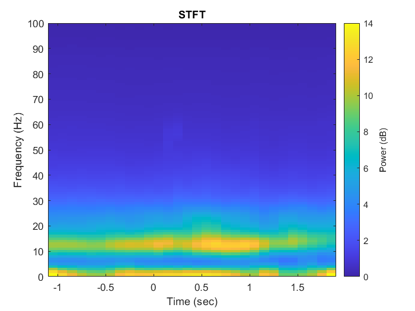
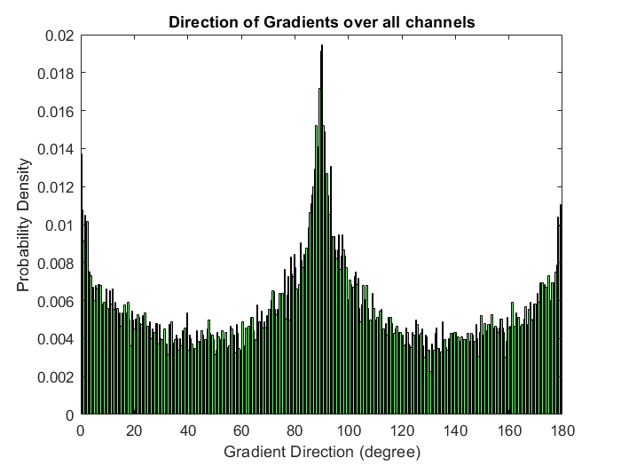
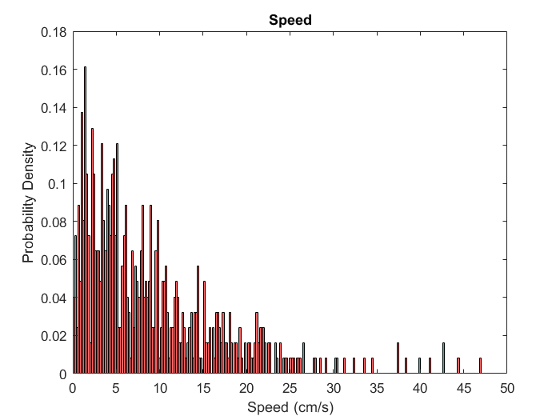

###### [Arya Koureshi](https://aryakoureshi.github.io)
###### 401204008
---

### 
 Investigation of Cortical Traveling Waves in Array dataset 

In this assignment we are going to analyze the activity of local field potential (LFP) recorded with multielectrode array in motor cortex. The task (Figure 1) is designed to study the encoding of working memory in Premotor Area F5. 
Although searching for significant correlations between neural signals (including spikes and LFP) and task variables might be interesting itself, here in this assignment we are going to investigate existence of mesoscopic traveling waves and their properties. Accordingly, you only need to know task timings of rather than task details.

 Figure 1 Delayed Response Task 

---

#### Task description
In this task, a monkey learns to follow instruction to receive tasty juice as reward (figure 1). At first, the monkey should keep its eyes on a fixation point in center of screen (red/green circle). To make sure monkey is looking at the desired point, we follow its eyes using an eye tracker. After a random duration between 300 to 500 ms fixating at fixation point, a cue will be presented in the periphery (step 2). Monkey must remember the spatial position of cue to either saccade or reach to that point after waiting for center light offset (step3). At the end, based on the color of target monkey reach/saccade to the expected location (step 4). If the monkey saccade/reach in the correct position, he will receive tasty juice! 

---

#### Data description
After the monkey gets fully trained in the task, we start recording from the Premotor Area F5, using an electrode array. This array includes 49 single electrodes distributed in an area of 12𝑚𝑚2. Distance between neighboring electrodes are 400 𝜇𝑚. (figure 2). In assignment folder you can find a session of electrophysiological recordings including timing of task.

---

#### LFP analysis 

As you know, since the start of course we have only used the band-pass filtered of raw extracellular signals to detect spikes. Generally, the extracellular potential results from current flow in the extracellular space, which in turn is produced by

transmembrane potentials in cells. These cellular events can be fast, 1ms, for action potentials which give rise to spikes and slow, up to 100ms, for post-synaptic potentials in dendrites and soma, which give rise to LFP. The low pass filtered of raw extracellular signals are known as local field potential (LFP). In this assignment all the LFP signals are down-sampled with 200 Hz to avoid time consuming runtimes in your further simulations.

The relationship between LFP and the firing of neurons depends on the brain state, however in many cases LFP convey extra information that is not encoded in single neurons.

In this part you are going to investigate any time-frequency modulation in LFP signals.

PSTHs are plotted for the most active neuron in each monkey.

**a. Find out the most dominant frequency oscillation. To do so you must plot averaged power spectrogram after doing color noise cancelation [see Reference 2].**

Importantly, only the trials labeled as 'clean' were included in the analysis.

Pink noise, also known as 1/f noise, is a signal whose power spectral density is inversely proportional to its frequency. In order to remove pink noise from a signal, I utilized a technique where I fit a line with a slope of -1 to the log-log Fast Fourier Transform (FFT) of the signal. Subsequently, I subtracted this line from the FFT to obtain a denoised version of the signal. Figure 1 illustrates the original and denoised power spectrums of the signal, along with the fitted line.

###### Average power spectrum

###### Original and denoised power spectrum

Based on the observation from the figure, the frequency range of 10 - 15Hz contains the dominant frequency.

---

**b. Cluster electrode group based on their dominant oscillation frequency. is there any topography in this clustering map? Guess why?**

In order to group the electrodes by their dominant frequency, I computed the Fast Fourier Transform (FFT) of individual channels for each trial. Subsequently, I plotted the average power spectrum of each channel's trials in below. 

The figure indicates that the dominant frequency for all the channels falls within the range of 10 - 15Hz.

As previously stated, all channels exhibit a dominant frequency around 12.5Hz, which falls within the 10-15Hz frequency range.

---

**c.  Plot power spectrum of LFP signals through the time. (Note: Although you can calculate power spectrogram using simple Fourier transform, it is better here to use advanced methods such as Welch and Multitaper).**

###### Removing pink noise
**STFT**

Below provides the parameters used to derive the Short-Time Fourier Transform (STFT) of the signal. Although smaller window sizes yield better time resolution, they may not capture low-frequency components. Therefore, I opted for the current parameters.

Paremeters of STFT:
1. Window type: kaiser
2. Window size: 300 ms
3. Window gain: 5
4. Overlap length: 200 ms
5. FFT Length: 200

**Welch**

Paremeters of STFT:
1. Window size: 200 ms
2. Overlap length: 100 ms
3. FFT Length: 200

The figures depict an increase in the power of the 10-15Hz frequency band after 500ms from the onset.

**Wavelet**

---

**d. Which Band frequency shows stronger power? Compare the timing patter of this power frequency blub with task timing. Compare your result with Hatsopoulos et.al 2006.**

The power of the beta frequency band appears to be stronger than the other frequency bands, as illustrated. Below figure includes both the average wavelet spectrogram of the signals (Fig. 1d of the paper) and my average wavelet power spectrum.

Figures show an increase in the power of the 10-20Hz frequency band after 500ms from the onset. These findings are consistent with the results obtained by Hatsopoulos et al. (2006).

---

#### Phase propagation (Traveling waves)

**a. Use a band-pass Butterworth filter (I suggest 2nd order!) to select most dominant oscillation of each electrodes LFP signal.**

I utilized a 3nd order Butterworth filter to bandpass filter the recorded signals. A crucial characteristic of this signal is its linear phase within the specified frequency range.

---

**b. Using Hilbert transform calculate instantaneous phase of filtered signals and store its result in a (7*7*number-of-trails*number-of-time-points) matrix named 𝜙(𝑥, 𝑦,𝑡)**

The formula used to compute the instantaneous phase is as follows:

---

**c. First design a demo to show the COS(𝜙(𝑥, 𝑦,𝑡)) during different time points. Do you see any traveling waves?!**

In the majority of the trials, I noticed a wave propagating from right to left.

---

**d. Based on what you have learned from reference papers (and also your creativity!), calculate the Phase Gradient Directionality, Direction of Propagation, and Speed of these traveling waves.**

**e. Add calculated traveling waves properties to your Demo for validation.**

#####  Direction of wave propagation (all trials)

######  All times

###### PGD > 0.5

The figure illustrates that the Probability Density Function (PDF) of the wave propagation direction, for times with PGD > 0.5, exhibits peaks at approximately 0 and 180 degrees, which supports the observation of the wave propagating from right to left, as demonstrated in the demo. The peak at 0 degrees is due to the fact that, when the wave travels from right to left, the gradients on the left side of the wave peak have a direction degree close to 180, whereas the gradient on the right side of the wave peak has a direction degree close to 0.

##### Direction of gradients (all trials of all channels)

######  All times

###### PGD > 0.5

The figure displays the Probability Density Function (PDF) of gradient direction, which exhibits peaks at approximately 0, 90, and 180 degrees. The peaks at 0 and 180 degrees are clarified in the preceding section, and there is a peak of roughly 90 degrees since electrodes situated in the first and last rows of the array can solely have gradient directions close to -90 and 90 degrees.

---

**f. Is there any preferred direction propagation for traveling waves? Design a test to validates its significance.**

Second plot of the figure of previous question illustrates that the wave propagation direction is primarily concentrated at 0 and 180 degrees during times with PGD > 0.5. To support this observation, I tested the null hypothesis that the distribution in question originated from a population with a mean of zero.

---

**g. Compare calculated averaged phase propagation speed with anatomical criteria’s in Sejnowski et.al 2018 (0.1-0.8m/s)**

##### Direction of gradient of all channels

######  All times

###### PGD > 0.5

The figure illustrates that the wave speed is roughly between 0 and 0.8 m/s, which is consistent with Sejnowski's paper.

---

#### References
1. S. Ben Hamed, J.R Duhamed, F.Bremmer , W.Graf, Cerebral Cortex, 2002 
2. Doug Rubino, Kay A Robbins & Nicholas G Hatsopoulos, Nature Neuroscience, 2006. 
3. Honghui Zhang, Andrew J. Watrous, Ansh Patel, & Joshua Jacobs, Neuron, 2018.
4. Lyle Muller, Frédéric Chavane, John Reynolds and Terrence J. Sejnowski, Nature Reviews Neuroscience, 2018

